## 作者：[zz632893783](https://github.com/zz632893783)

项目地址：[zz632893783/canvas-3d](https://github.com/zz632893783/canvas-3d)

文章地址：[在canvas上绘制3d图形 - 简书](https://www.jianshu.com/p/e3ebe08dddad)

## 描述
文章里有相当多的内容，用到了中学数学的知识，推导3d几何模型是如何绘制到2d平面中去的，最终利用推导出的结论编写代码，将3d模型渲染到2d平面上

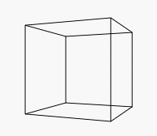

## 数学原理
矩形和三角形相似原理，不懂看，新高/旧高=新宽/旧宽

### 1、从z轴观察yz平面上的点
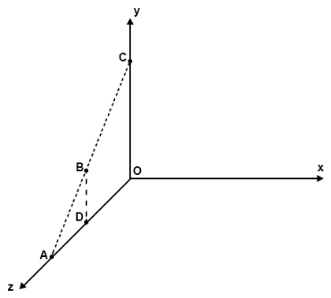

想象一下有这么一个三维空间（如图），有一个点B，我们从A点观察B点。那么B点在xy平面上的投影即AB的延长线与平面xy的交点C。而xy平面不就是可以看一个二维的canvas画布吗。

我们暂且将A点放在z轴，B点放在yz平面，则A点的三维坐标可以表示为
A(0，0，zA)，B点的三维坐标可以表示为B(0，yB，zB)。从B点做一条垂线垂z轴于D点。
△ADB与△AOC是相似三角形，所以有

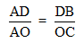

_注释：AD/AO = DB/OC_

变换得


_注释：OC = DB * AO / AD_

_注释2：OC = DB * AO / ( AO - DO )_

_注释3：AO - DO = AD_

其中DB即B点的y坐标，AO即A点的z坐标，DO即B点的z坐标，所以

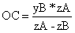

这里的OC也就是C点的y坐标。

### 2、从z轴观察xz平面上的点

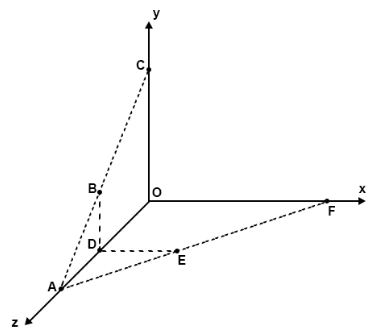

同理我们从A点观察平面xz上的某一点E(xE，0，zE)，△ADE与△AOF是相似三角形

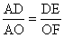

变换得

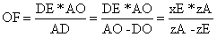

### 3、从z轴观察空间内任意坐标

之前所观测的B点是位于yz平面内，E点是位于xz平面内，但是如果是空间内任意位置的点呢
其实道理都是一样的，如下如

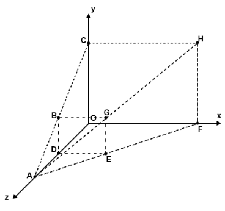

如果将直线BD平移到E点，直线ED平移到B点，那么将形成一个矩形DBGE，矩形DBGE在xy平面上的投影为矩形OCHF。

a、由于△AGE与△AHF相似，所以有

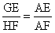

b、并且由于△ADE与△AOF也是相似三角形，所以

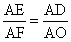

c、所以


推导得

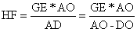

其中GE也就是G点的y坐标，因为矩形DBGE是平行于xy平面的，所以它们z坐标相同，DO等价于G点的z坐标，所以对于空间内任意位置G(xG，yG，zG)

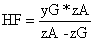

> 上面算HF的高，有点绕圈子。可以换个思路，由于G点是由DB平移产生的，又由于B点和G点的观察点都是A点，所以算BD就等于算GE，算OC就是算FH。想象一下，从x轴看zy平面，△ADB与△AOC是相似三角形，所以有 DB/OC=AD/AO，就这样通过计算OC，得出了FH点的长度

同样的方法我们可以推导出

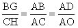

变换得


> 上面算CH的长度，同样也有点绕圈子，同样也可以换个思路。从y轴看zx平面，△ADE与AOF是相似三角形，所以有DE/OF=AD/AO，这样通过计算OF的长度，得到了CH的长度

结合上两步，CH是H点的x坐标，HF是H点的y坐标，所以从轴上的点A(0，0，zA)观察空间内任意位置G(xG，yG，zG)在平面xy上的投影可表示为


### 4、从任意位置观察空间内任意坐标
##### a、沿着x轴平移坐标系

之前的推论到从z轴观察空间内任意位置的投影了，但是实际上A点是有特殊性的，因为它是位于z轴上的某一个点，其xy坐标都为0，如果A是空间内的任意一个点，情况又如何，请看下图

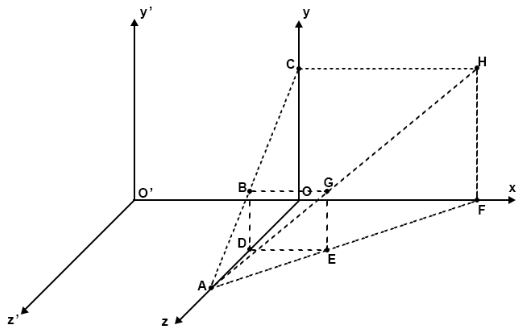

假设这个时候真正的坐标系是xy'z'，而坐标系xyz是我们临时所建立的一个虚拟的坐标系，那么这个时候A点相对于坐标系xy'z'来说，坐标点可表示为A(xA，0，zA)，G点依旧表示为(xG，yG，zG)

我们之前推导的相似三角形的关系，即使换了坐标系，它们的关系依然成立，所以


变换得


#### 注意：这个时候 BG=xG-xA，

AO和DO与之前相同

求得

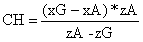

之前推导出的相似三角形关系依旧成立，所以

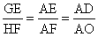

变换得


由于GE，AO，DO与之前相比都没有变化，

所以得


与之前的推导一致，最后我们得出结论，我们沿着x轴方向移动坐标系的时候（即图中的坐标系有xy'z'移动到了xyz位置），G点在平面xy的投影H点的y坐标不会有变化，但是x坐标为

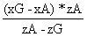

##### b、沿着y轴平移坐标系

如下图

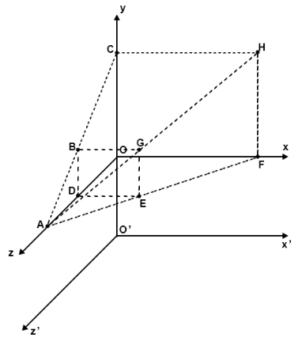

假设x'yz'是真正的坐标系，沿着y轴平移得到临时坐标系xyz，推导步骤和之前的相同，这里不再赘述，直接贴结果

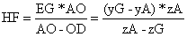


#### 注意：这个时候 EG=yG-yA

也就是说当沿着y轴方向移动坐标系的时候，投影H的x坐标不会有变化，y坐标变为


##### c、对于空间内任意位置

对于空间内任意位置，我们都可以看成是在z轴上的某一点A(0，0，zA)，先经历一次x轴方向的平移（此时投影H的y坐标不变），再经历一次y轴方向的平移（此时投影H的x坐标不变），平移之前点A观察到点G的投影H坐标可表示为

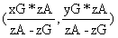

对其进行x轴方向的平移，（此时投影H的y坐标不变），H的坐标可表示为

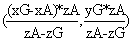

再对其进行y轴方向的平移，（此时投影H的x坐标不变），H的坐标可表示为

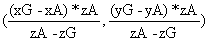

### 5、最终结论

从空间内的任意点A(xA，yA，zA)观察空间内的任一点G(xG，yG，zG)，它在xy平面内的投影H的坐标为


首先我们尝试写一个简单的几何图形

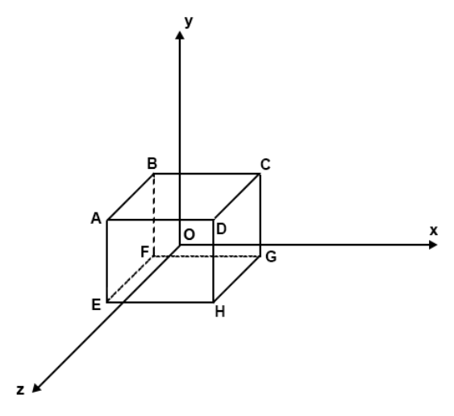

立方体边长为100，则A(-50，50，50)，B(-50，50，-50)，C(50，50，-50)，D(50，50，50)，E(-50，-50，50)，F(-50，-50，-50)，G(50，-50，-50)，H(50，-50，50)，假定从z轴上某一点(0，0，300)观察

```html
<template>
    <div class="cube">
        <canvas ref="cube" v-bind:width="canvasWidth" v-bind:height="canvasHeight"></canvas>
    </div>
</template>
<script>
export default {
    data: function () {
        return {
            canvasWidth: 600,
            canvasHeight: 400,
            ctx: null,
            visual: {
                x: 0,
                y: 0,
                z: 300
            },
            pointMap: {
                A: (-50, 50, 50),
                B: (-50, 50, -50),
                C: (50, 50, -50),
                D: (50, 50, 50),
                E: (-50, -50, 50),
                F: (-50, -50, -50),
                G: (50, -50, -50),
                H: (50, -50, 50)
            }
        }
    },
    methods: {
        init: function () {
            this.ctx = this.$refs.cube.getContext('2d')
        },
        draw: function () {}
    },
    mounted: function () {
        this.init()
        this.draw()
    }
}
</script>
```

绘制方法也很简单，分别绘制矩形ABCD，矩形EFGH，然后再将AE,BF,CG,DH连线即可，只不过这里的ABCDEFGH点需要换算成投影在三维坐标系xy平面上的点，运用我们之前得出的结论，我们定义一个转换坐标点的函数

```javascript
        transformCoordinatePoint: function (x, y, z, offsetX = this.canvasWidth / 2, offsetY = this.canvasHeight / 2) {
            return {
                x: (x - this.visual.x) * this.visual.z / (this.visual.z - z) + offsetX,
                y: (y - this.visual.y) * this.visual.z / (this.visual.z - z) + offsetY
            }
        }
```
然后编写draw函数
```javascript
        draw: function () {
            let point
            this.ctx.clearRect(0, 0, this.canvasWidth, this.canvasHeight)
            // 绘制矩形ABCD
            this.ctx.beginPath()
            point = this.transformCoordinatePoint(...this.pointMap.A)
            this.ctx.moveTo(point.x, point.y)
            point = this.transformCoordinatePoint(...this.pointMap.B)
            this.ctx.lineTo(point.x, point.y)
            point = this.transformCoordinatePoint(...this.pointMap.C)
            this.ctx.lineTo(point.x, point.y)
            point = this.transformCoordinatePoint(...this.pointMap.D)
            this.ctx.lineTo(point.x, point.y)
            this.ctx.closePath()
            this.ctx.stroke()
            // 绘制矩形EFGH
            this.ctx.beginPath()
            point = this.transformCoordinatePoint(...this.pointMap.E)
            this.ctx.moveTo(point.x, point.y)
            point = this.transformCoordinatePoint(...this.pointMap.F)
            this.ctx.lineTo(point.x, point.y)
            point = this.transformCoordinatePoint(...this.pointMap.G)
            this.ctx.lineTo(point.x, point.y)
            point = this.transformCoordinatePoint(...this.pointMap.H)
            this.ctx.lineTo(point.x, point.y)
            this.ctx.closePath()
            this.ctx.stroke()
            // 绘制直线AE
            this.ctx.beginPath()
            point = this.transformCoordinatePoint(...this.pointMap.A)
            this.ctx.moveTo(point.x, point.y)
            point = this.transformCoordinatePoint(...this.pointMap.E)
            this.ctx.lineTo(point.x, point.y)
            this.ctx.stroke()
            this.ctx.closePath()
            // 绘制直线BF
            this.ctx.beginPath()
            point = this.transformCoordinatePoint(...this.pointMap.B)
            this.ctx.moveTo(point.x, point.y)
            point = this.transformCoordinatePoint(...this.pointMap.F)
            this.ctx.lineTo(point.x, point.y)
            this.ctx.stroke()
            this.ctx.closePath()
            // 绘制直线CD
            this.ctx.beginPath()
            point = this.transformCoordinatePoint(...this.pointMap.C)
            this.ctx.moveTo(point.x, point.y)
            point = this.transformCoordinatePoint(...this.pointMap.G)
            this.ctx.lineTo(point.x, point.y)
            this.ctx.stroke()
            this.ctx.closePath()
            // 绘制直线DH
            this.ctx.beginPath()
            point = this.transformCoordinatePoint(...this.pointMap.D)
            this.ctx.moveTo(point.x, point.y)
            point = this.transformCoordinatePoint(...this.pointMap.H)
            this.ctx.lineTo(point.x, point.y)
            this.ctx.stroke()
            this.ctx.closePath()
        }
```
查看代码运行结果

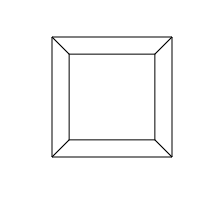

似乎是对的，但是有感觉怪怪的，我们尝试将立方体绕着y轴旋转

这里需要另一个数学关系的推导


想象一下从y轴俯视yz平面，这个时候点D的位置关系如下图

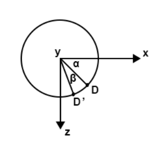

这个时候假定D点与x轴的夹角是α，圆的半径为R，将D点绕着y轴旋转β旋转至D'点，这个时候D'与x轴夹角为α+β，此时D'的x坐标为cos(α+β)*R，D'的z坐标为sin(α+β)*R
回一下中学时候我们学过的三角形倍角公式

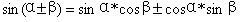

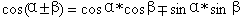

D'的x坐标cos(α+β)*R=R*cosα*cosβ-R*sinα*sinβ

D'的z坐标sin(α+β)*R=R*sinα*cosβ+R*cosα*sinβ

而R*sinα就是旋转之前D点的z坐标，R*cosα就是旋转之前D点的x坐标，

D'的x坐标为x*cosβ-z*sinβ

D'的z坐标为z*cosβ+x*sinβ

将结论代入到我们的立方体的8个顶点ABCDEFGH中

对于任一点D(xD，yD，zD)，其绕y轴旋转β角的时候，它的三维坐标变为

(xD*cosβ-zD*sinβ，yD，zD*cosβ+xD*sinβ)

转换为代码
```javascript
    methods: {
        init: function () {
            this.ctx = this.$refs.cube.getContext('2d')
        },
        transformCoordinatePoint: function (x, y, z, offsetX = this.canvasWidth / 2, offsetY = this.canvasHeight / 2) {
            return {
                x: (x - this.visual.x) * this.visual.z / (this.visual.z - z) + offsetX,
                y: (y - this.visual.y) * this.visual.z / (this.visual.z - z) + offsetY
            }
        },
        draw: function () {
            let point
            this.ctx.clearRect(0, 0, this.canvasWidth, this.canvasHeight)
            // 绘制矩形ABCD
            this.ctx.beginPath()
            point = this.transformCoordinatePoint(...this.pointMap.A)
            this.ctx.moveTo(point.x, point.y)
            point = this.transformCoordinatePoint(...this.pointMap.B)
            this.ctx.lineTo(point.x, point.y)
            point = this.transformCoordinatePoint(...this.pointMap.C)
            this.ctx.lineTo(point.x, point.y)
            point = this.transformCoordinatePoint(...this.pointMap.D)
            this.ctx.lineTo(point.x, point.y)
            this.ctx.closePath()
            this.ctx.stroke()
            // 绘制矩形EFGH
            this.ctx.beginPath()
            point = this.transformCoordinatePoint(...this.pointMap.E)
            this.ctx.moveTo(point.x, point.y)
            point = this.transformCoordinatePoint(...this.pointMap.F)
            this.ctx.lineTo(point.x, point.y)
            point = this.transformCoordinatePoint(...this.pointMap.G)
            this.ctx.lineTo(point.x, point.y)
            point = this.transformCoordinatePoint(...this.pointMap.H)
            this.ctx.lineTo(point.x, point.y)
            this.ctx.closePath()
            this.ctx.stroke()
            // 绘制直线AE
            this.ctx.beginPath()
            point = this.transformCoordinatePoint(...this.pointMap.A)
            this.ctx.moveTo(point.x, point.y)
            point = this.transformCoordinatePoint(...this.pointMap.E)
            this.ctx.lineTo(point.x, point.y)
            this.ctx.stroke()
            this.ctx.closePath()
            // 绘制直线BF
            this.ctx.beginPath()
            point = this.transformCoordinatePoint(...this.pointMap.B)
            this.ctx.moveTo(point.x, point.y)
            point = this.transformCoordinatePoint(...this.pointMap.F)
            this.ctx.lineTo(point.x, point.y)
            this.ctx.stroke()
            this.ctx.closePath()
            // 绘制直线CD
            this.ctx.beginPath()
            point = this.transformCoordinatePoint(...this.pointMap.C)
            this.ctx.moveTo(point.x, point.y)
            point = this.transformCoordinatePoint(...this.pointMap.G)
            this.ctx.lineTo(point.x, point.y)
            this.ctx.stroke()
            this.ctx.closePath()
            // 绘制直线DH
            this.ctx.beginPath()
            point = this.transformCoordinatePoint(...this.pointMap.D)
            this.ctx.moveTo(point.x, point.y)
            point = this.transformCoordinatePoint(...this.pointMap.H)
            this.ctx.lineTo(point.x, point.y)
            this.ctx.stroke()
            this.ctx.closePath()
        },
        animationFrame: function () {
            let rotationAngle = 1
            window.requestAnimationFrame(() => {
                for (let key in this.pointMap) {
                    let point = this.pointMap[key]
                    // 保存x,y,z坐标
                    let x = point[0]
                    let y = point[1]
                    let z = point[2]
                    // 变换后的x坐标
                    point[0] = x * Math.cos(rotationAngle / 180 * Math.PI) - z * Math.sin(rotationAngle / 180 * Math.PI)
                    // 绕y轴旋转，y左边不会发生变化
                    point[1] = y
                    // 变换后的z坐标
                    point[2] = z * Math.cos(rotationAngle / 180 * Math.PI) + x * Math.sin(rotationAngle / 180 * Math.PI)
                }
                this.draw()
                this.animationFrame()
            })
        }
    },
    mounted: function () {
        this.init()
        this.animationFrame()
    }
```

代码运行效果


