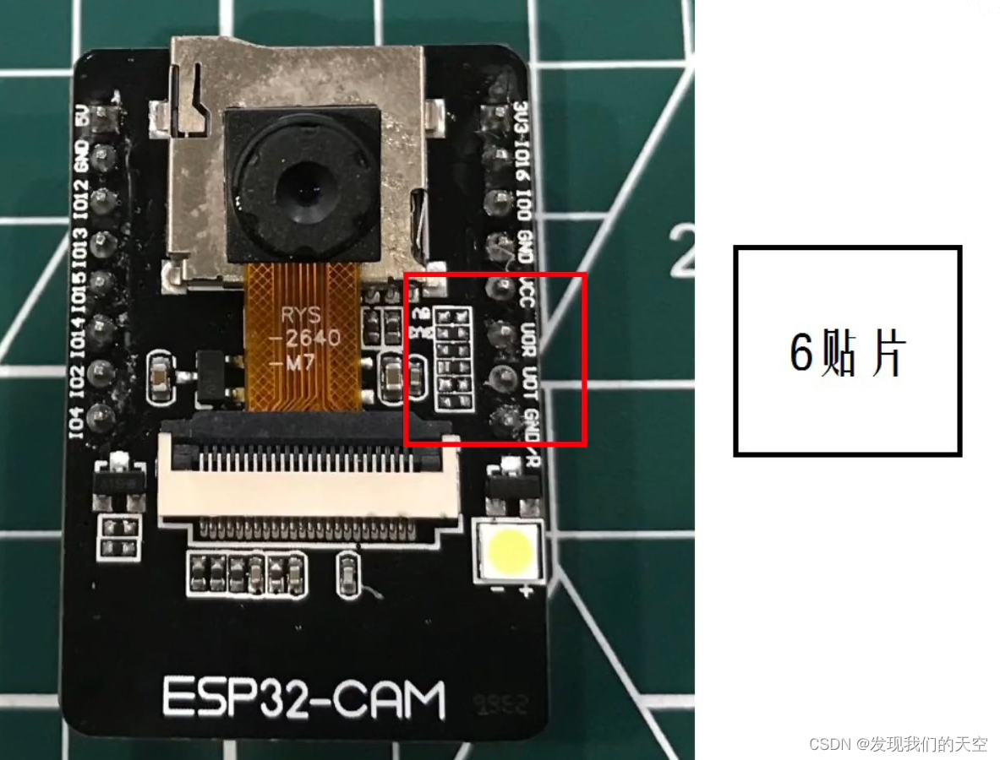

# esp32-cam

一般情况下esp32-cam板子上没有usb口，所以烧录或调试时，需要额外购买一个usb转ttl模块(工具)，usb转ttl模块(工具)是CP2102或CH340都行

# esp32-cam的两个版本

从正面电阻来区分：4电阻、6电阻(新款)

## 下载模式(烧录模式)(刷microPython的过程)

|  ESP32-CAM   | CH340  | 说明  |
|  ----         | ----  | ----  |
|   5V          |   5V   |   无   |
|   U0R         |   TXD   |  R是接收，T是传送，需要一边接一边收 |
|   U0T         |   RXD   | R是接收，T是传送，需要一边接一边收 |
|   GND          |   GND  | 地线                                |
|   IO0 短路 GND  |    无  | 让 ESP32-CAM 进入下载模式          |

### 6电阻，烧录工具有CH340和CP2102两种串口工具，这俩烧录时有区别：

6电阻+CH340  注意，仅能使用5V供电和右上GND，其他都不行

6电阻+CP2102，注意，右下方的GND是不可以使用的，3V3和5V和VCC三者中任意一个

4电阻+CH340，与上边6电阻+CH340一样，仅能使用5V供电和右上GND

4电阻+CP2102，此时GND均可使用

## micropython-camera固件

[lemariva/micropython-camera-driver](https://github.com/lemariva/micropython-camera-driver)

第一步、单击 firmware 目录

第二步、下载 micropython_camera_feeeb5ea3_esp32_idf4_4.bin

## 运行调试模式

运行调试模式与下载烧录模式接线区别是，(esp32-cam的IO0口)不用短路(esp32-cam的GND口)

|  ESP32-CAM   | CH340  | 说明  |
|  ----         | ----  | ----  |
|   5V          |   5V   |   无   |
|   U0R         |   TXD   |  R是接收，T是传送，需要一边接一边收 |
|   U0T         |   RXD   | R是接收，T是传送，需要一边接一边收 |
|   GND          |   GND  | 地线                                |

# 参考链接

[esp32cam开发板烧录micropython固件报错问题（完美解决）](https://www.bilibili.com/read/cv27647802)

[安装 MicroPython 到 ESP32-CAM - 使用esptool (Windows)](https://blog.csdn.net/m0_50614038/article/details/129330560)

[lemariva/micropython-camera-driver](https://github.com/lemariva/micropython-camera-driver)

[ESP32-CAM烧录问题](https://blog.csdn.net/Smithkily/article/details/131943618)

[esp32cam（6贴片位）烧录MicroPython的方法（ch340）](https://www.cnblogs.com/daweiguo/p/17611291.html)

[【esp32-cma】OSError: Camera Init Failed解决办法](https://blog.csdn.net/CSRAWD/article/details/131745163)

[ESP32-CAM 使用 MicroPython 进行开发 - 使用图形化工具 Thonny (Mac)](https://blog.csdn.net/m0_50614038/article/details/128399359)

[esp32cam烧录笔记openmv/micropython](https://www.bilibili.com/video/BV1FT411E7gA)

[ESP32-CAM 与USB TTL下载与运行接线](https://www.cnblogs.com/meetrice/p/14094895.html)