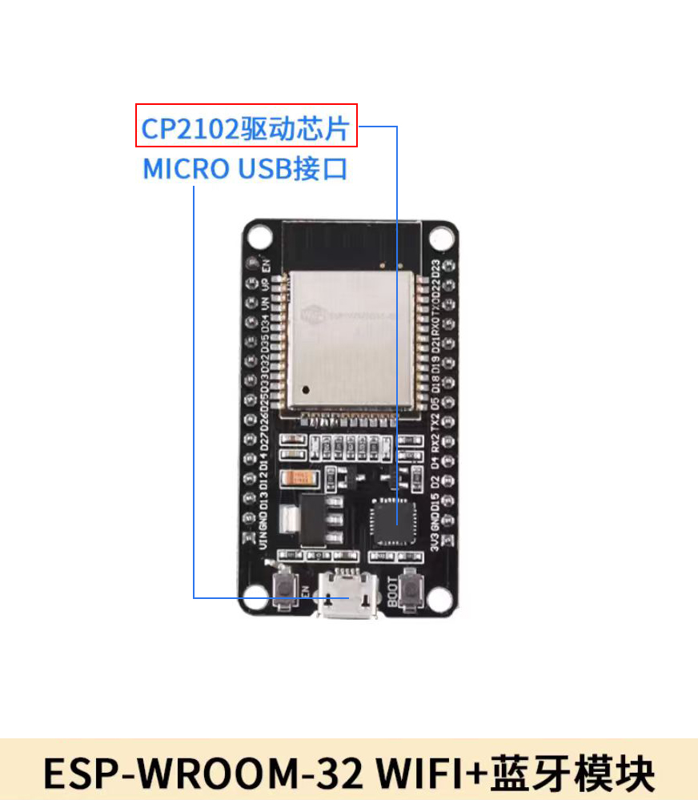
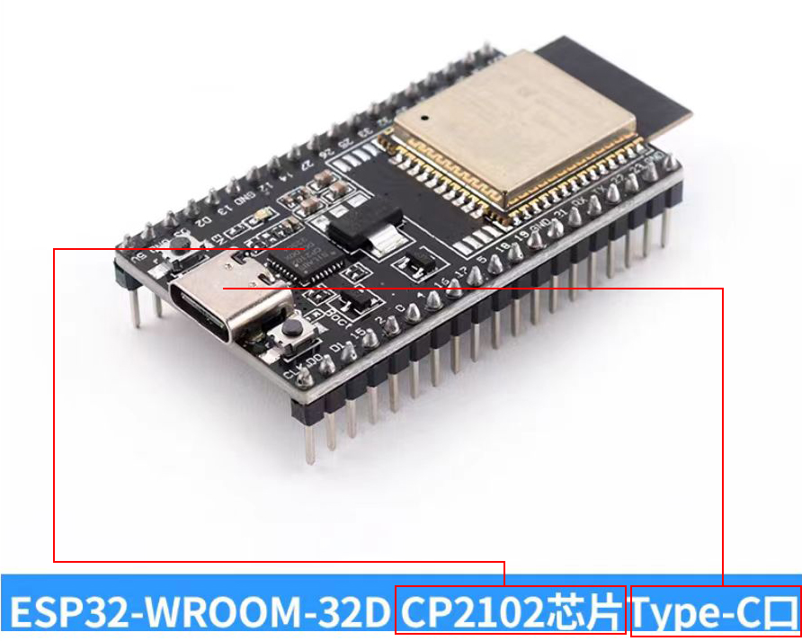
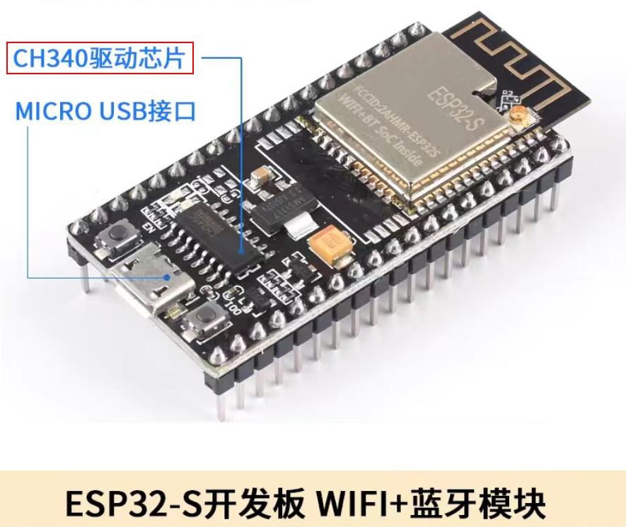
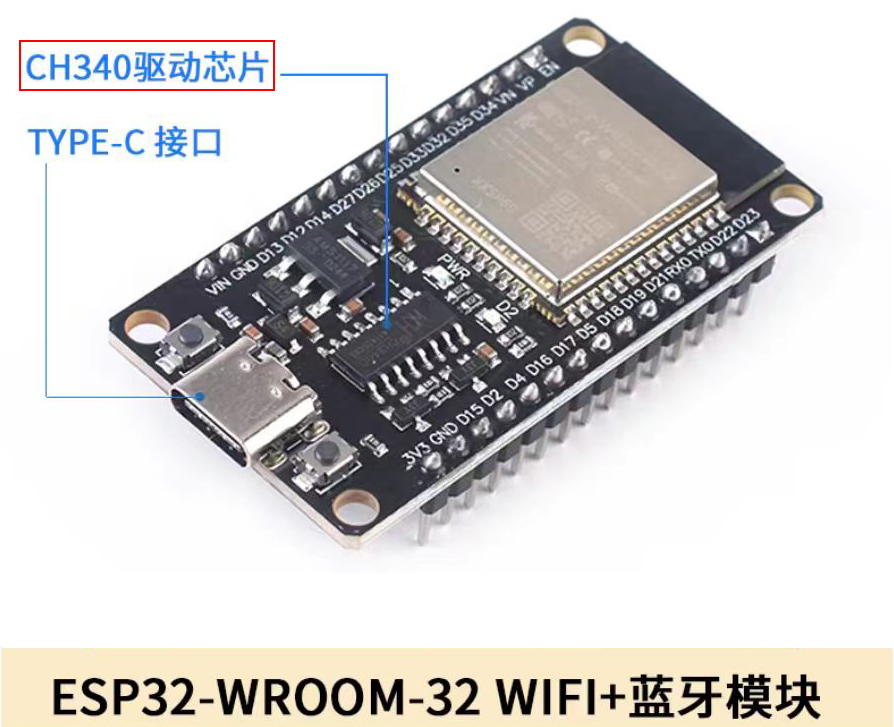
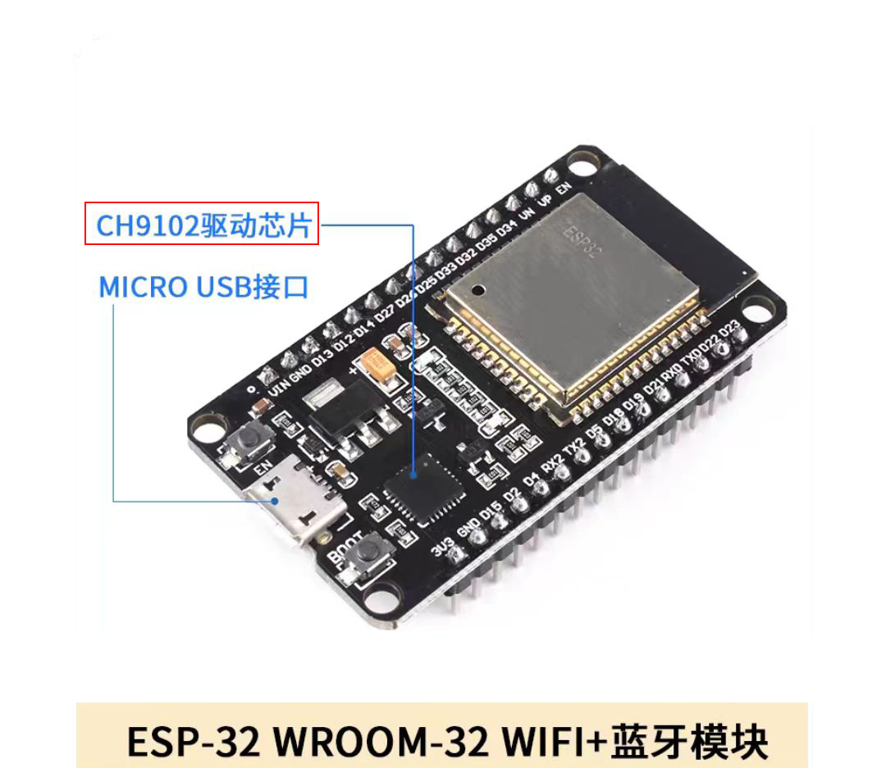

# esp32编程内容，详细请看b站王铭东老师的esp32课程

# 注意，如果无法烧录，请根据thoony的提示，按一下esp32上的boot键(进入下载模式)

# 关于esp32的usb串口驱动问题

带有usb口的esp32设备，usb驱动有多种(CP2102、CH340、CH9102、等等)，usb口也有多种(Type-c、Micro-usb)，调试使用时请根据实际情况安装相应驱动。

CP2102 + Micro-usb

CP2102 + Type-c

CH340 + Micro-usb

CH340 + Type-c

CH9102 + Micro-usb

