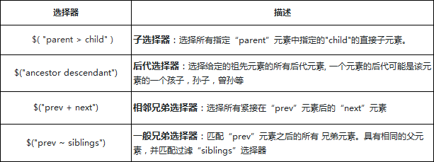
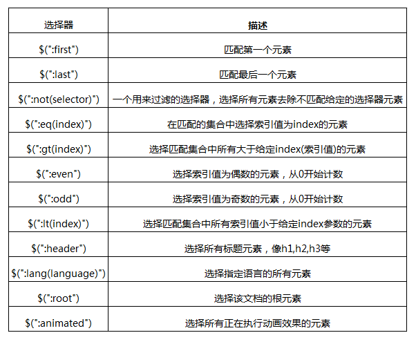
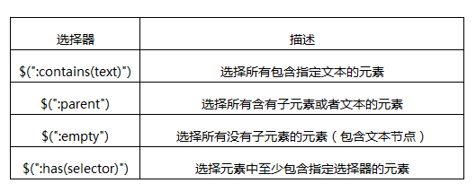
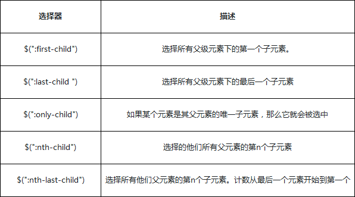
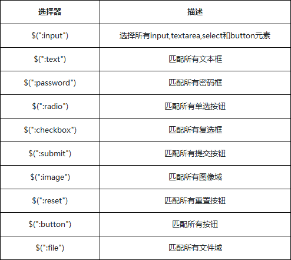

# jquery常用语句

#### jq设置input checkbox（多选）或radio（单选）选中
```javascript
$("#vehiclesss").prop("checked",true);
```
#### jq设置input checkbox（多选）或radio（单选）不选中
```javascript
//<input id="vehiclesss" type="checkbox" name="vehicle" value="Car" checked>
//<input id="xingbie" type="radio" name="gender" value="女" checked> 女<br>
$("#vehiclesss").prop("checked",false);
```

#### jq获取的元素对象转Dom对象
```javascript
//方式1
var $div = $('div') //jQuery对象
var div = $div[0] //转化成DOM对象
div.style.color = 'red' //操作dom对象的属性

//方式2
var $div = $('div') //jQuery对象
var div = $div.get(0) //通过get方法，转化成DOM对象
div.style.color = 'red' //操作dom对象的属性
```
#### Dom对象转jq获取的元素对象
```javascript
var div = document.getElementsByTagName('div'); //dom对象
var $div = $(div); //jQuery对象
var $first = $div.first(); //找到第一个div元素
$first.css('color', 'red'); //给第一个元素设置颜色
```
#### jq获取子元素 后代元素 兄弟元素 相邻元素

```javascript
//子选择器
//选择所有div元素里面的所有子元素P
$('div > p')

//后代选择器
//选择所有div元素里面的所有子元素P
$('div h1').css("border", "1px groove red")

//相邻兄弟选择器
//选取div后面的第一个的h1兄弟节点
$('div + h1').css("border", "1px groove red");

//一般相邻选择器
//选取div后面的所有的h1兄弟节点
$("div ~ h1").css("border", "3px groove blue");
```
#### 获取元素筛选器

```javascript
//找.div的第一个
$(".div:first").css("color", "#CD00CD");

//找.div的最后一个
$(".div:last").css("color", "#CD00CD");

//:even 选择所引值为偶数的元素，从 0 开始计数
$(".div:even").css("border", "3px groove red");

//:odd 选择所引值为奇数的元素，从 0 开始计数
$(".div:odd").css("border", "3px groove blue");

//:eq
//选择.aaron集合中下标（索引值）为2的那个元素
$(".aaron:eq(2)").css("border", "3px groove blue");

//:gt 选择匹配集合中所有索引值大于给定index参数的元素
$(".aaron:gt(3)").css("border", "3px groove blue");

//:lt 选择匹配集合中所有索引值小于给定index参数的元素
//与:gt相反
$(".aaron:lt(2)").css("color", "#CD00CD");

//选中所有紧接着没有checked属性的input元素后的p元素，赋予颜色
$("input:not(:checked) + p").css("background-color", "#CD00CD");
```
#### 内容筛选器

```javascript
//查找所有class='div'中DOM元素中包含"contains"的元素节点
//并且设置颜色
$(".div:contains(':contains')").css("color", "#CD00CD");

//查找所有class='div'中DOM元素中包含"span"的元素节点
//并且设置颜色
$(".div:has(span)").css("color", "blue");

//选择所有包含子元素或者文本的a元素
//增加一个蓝色的边框
$("a:parent").css("border", "3px groove blue");

//找到a元素下面的所有空节点(没有子元素)
//增加一段文本与边框
$("a:empty").text(":empty").css("border", "3px groove red"); 
```
#### 属性筛选器
#### 
```javascript
//查找所有div中，属性name=p1的div元素
$('div[name=p1]').css("border", "3px groove red");

//查找所有div中，有属性name中的值只包含一个连字符“-”的div元素
$('div[name|="-"]').css("border", "3px groove #00FF00"); 

//查找所有div中，有属性name中的值包含一个连字符“空”和“a”的div元素
$('div[name~="a"]').css("border", "3px groove #668B8B");

//查找所有div中，属性name的值是用imooc开头的
$('div[name^=imooc]').css("border", "3px groove red");

//查找所有div中，属性name的值是用imooc结尾的
$('div[name$=imooc]').css("border", "3px groove blue");

//查找所有div中，有属性name中的值包含一个test字符串的div元素
$('div[name*='test']').css("border", "3px groove #00FF00");

//查找所有div中，有属性testattr中的值没有包含"true"的div
$('div[testattr!="true"]').css("border", "3px groove #668B8B");
```
#### 子元素筛选器

```javascript
//查找class="first-div"下的第一个a元素
//针对所有父级下的第一个
$('.first-div a:first-child').css("color", "#CD00CD");

//查找class="first-div"下的最后一个a元素
//针对所有父级下的最后一个
//如果只有一个元素的话，last也是第一个元素
$('.first-div a:last-child').css("color", "red");

//查找class="first-div"下的只有一个子元素的a元素
$('.last-div a:only-child').css("color", "blue");

//查找class="last-div"下的第二个a元素
$('.last-div a:nth-child(2)').css("color", "#CD00CD");

//查找class="last-div"下的倒数第二个a元素
$('.last-div a:nth-last-child(2)').css("color", "red");
```
#### 表单元素筛选器

```javascript
//查找所有 input, textarea, select 和 button 元素
//:input 选择器基本上选择所有表单控件
$(':input').css("border", "1px groove red");

//匹配所有input元素中类型为text的input元素
$('input:text').css("background", "#A2CD5A");

//匹配所有input元素中类型为password的input元素
$('input:password').css("background", "yellow");

//匹配所有input元素中的单选按钮,并选中
$('input:radio').attr('checked','true');

//匹配所有input元素中的复选按钮,并选中
$('input:checkbox').attr('checked','true');

//匹配所有input元素中的提交的按钮,修改背景颜色
$('input:submit').css("background", "#C6E2FF");

//匹配所有input元素中的图像类型的元素,修改背景颜色
$('input:image').css("background", "#F4A460");

//匹配所有input元素中类型为按钮的元素
$('input:button').css("background", "red");

//匹配所有input元素中类型为file的元素
$('input:file').css("background", "#CD1076");
```
#### .html([value])和.text([value])
```javascript
//设置元素内容
$('#a10').html('111111')
$('#a10').html('<h1>111</h1>')

//获取元素内容
//<div id="a10">111</div>
$("#a10").html() //返回：111

//<div id="a10"><h1>111</h1></div>
$("#a10").html() //返回：<h1>111</h1>元素

//设置文本内容
$('#a10').text('111111');

//设置获取文本内容
//<div id="a10"><h1>111</h1></div>
$('#a10').text();//返回："<h1>111</h1>"字符串

```
#### 元素样式class
```javascript
//增加一个元素样式class
$("#a10").addClass("newClass")

//移除一个元素样式class
$("#a10").removeClass('newClass')

//设置一个style
$("#a10").css("background-color","green")

//设置多个style
$("#a10").css({"background-color":"green","color":"red"})

//获取style
$("#a10").css("background-color") //打印：rgb(0, 128, 0)
```
#### 设置获取元素属性值
```javascript
//jq设置元素属性值
$('#A10').attr("data","180");

//jq获取元素属性值
$('#A10').attr("data");

//jq移除元素属性值
$('#A10').removeAttr('data')

//原生js设置元素属性值 IE8及更早IE版本不支持该方法
document.getElementById('A10').setAttribute("data", "newDiv")

//原生js获取元素属性值1
//<div id="A10" data='1' data2='2'></div>
document.getElementById('A10').getAttribute("data") //返回：1

//原生js返回元素属性列表

document.getElementById('A10').attributes

//原生js获取元素属性值2
//<div id="A10" data='1' data2='2'></div>
document.getElementById('A10').attributes.data //返回：data="1"
```
#### 原生js创建元素
```javascript
/**
 * 
创建元素：document.createElement
设置属性：setAttribute
添加文本：innerHTML
加入文档流：appendChild
 */
var aDiv = document.createElement('div')
var bDiv = document.createElement("div");
aDiv.setAttribute('class', 'right')
bDiv.className = 'newClassesOfb'
bDiv.innerHTML = "动态创建DIV元素节点";
aDiv.appendChild(bDiv)
//绘制到页面body
document.querySelector('body').appendChild(adiv)
```
#### jq创建元素
```javascript
$('body').append("<div class='aDiv'><div class='bDiv'>哈哈哈哈</div></div>")
```
#### jq清空节点内的内容
```javascript
$("#test").empty()//只清空内容，元素不删除
```
#### jq清除元素
```javascript
$(".test1").remove()//内容和元素都会被删除
```
#### 获取元素的子元素（children）
```javascript
//children只查找第一级的子节点
//给所有.div的第一个子元素设置border
$(".div").children().css('border','1px solid red')

//给最后一个.div的子元素设置一个border
$('.div').children(':last').css('border', '3px solid blue')
```
#### 获取元素的子元素（find）
```javascript
//find查找范围包括子节点的所有后代节点
$(".left").find('li').eq(0).css('border','1px solid red')
//eq()是选取返回的元素列表的第几个，从0开始
```
#### each遍历元素
```javascript
$("#a10").find('h1').each(function(index, element) {
    $(this).css('color','blue')
});
```
#### 绑定事件
```javascript
$('#a10').click(function(e) {
    alert(e.target.textContent)
})
//change事件内容发生变化触发
//input,select,textarea
$('.target1').change(function(e) {
    console.log(e.target.value)
});
```
#### 绑定事件on
```javascript
//所有的快捷事件在底层的处理都是通过一个"on"方法来实现的
$("#elem").click(function(){})  //快捷方式
$("#elem").on('click',function(){}) //on方式
```
#### 解绑事件
```javascript
//解绑一个事件
$('#a10').off("click")

//解绑多个事件
$('#a10').off("click change")

//解绑所有事件
$("elem").off()
```

#### ajax中设置请求头
```javascript
$.ajax({
    url: "地址",
    type: "post",
    beforeSend: function (XMLHttpRequest) {
		//设置自定义请求头
        XMLHttpRequest.setRequestHeader('accept-blacc', 'zhanbuwawa');
    },
    success: function (data) {
        console.log(data);
    }, error: function (err) {
        console.log(err)
    }
})

```