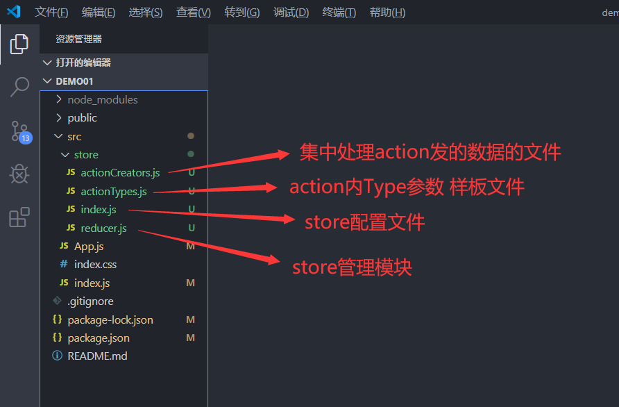
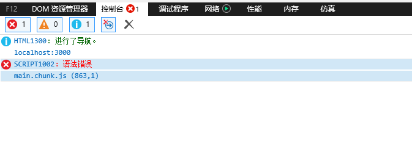
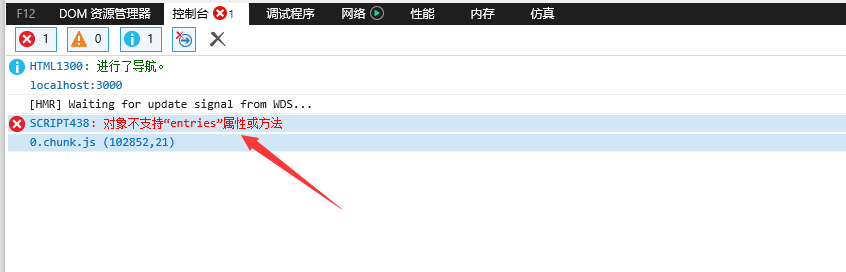

# React记事本
**谨记：每个框架都有其自己的特点，这也是为什么有这么多优秀的框架出现的原因。正因为都有各自的特点，所以编程方式上会有一些区别。能利用好这些好的特点才能成为 好的程序员 加油！**
#### React有状态组件
```javascript
import React,{Component,Fragment} from 'react';
//const Component = React.Component
//const Fragment = React.Fragment
class App extends Component{
	constructor(props) {
	    super(props)
	        this.state = {}
	    }
	}
	componentWillMount() {
	    console.log('组件将要挂载到页面上-componentWillMount');
		
		//1、这时已经能访问到this.state里数据
		
		//2、子组件第一次挂载前在这里已经能访问到this.props里的数据，
		//在这里可以利用该方法解决componentWillReceiveProps方法在第一次接收父组件数据不执行的问题
		
		//3、组件将要更新（改变）时不执行这个函数，组件因更新而改变前执行componentWillUpdate方法
		
		//4、不管是子组件还是父组件，只要是组件不重新挂载不重新运行，只是组件更新数据改变都不重新运行这个方法，
		//由更新数据而改变组件，在渲染前运行componentWillUpdate方法
	}
	render() {
	    console.log('组件正在渲染-render');
		
		//1、负责组件渲染，组件第一次，和改变都会执行
	    return ()
	}
	componentDidMount() {
		console.log('组件挂载完毕后-componentDidMount');
		
		//1、组件更新（改变）完成时不执行这个方法，更新（改变）完成执行componentDidUpdate方法
		
		//2、不管是子组件还是父组件，只要是组件不重新挂载不重新运行，只是组件更新数据改变都不重新运行这个方法，
		//由更新数据而改变组件，在渲染运行后componentDidUpdate方法
	}
	shouldComponentUpdate(nextProps, nextState) {
	    console.log('Props或State发生改变询问组件是否需要变化-shouldComponentUpdate');
		
		//1、如果当前是子组件，发现Props发生改变，子组件会先执行componentWillReceiveProps方法，
		//子组件内接收到props新数据，componentWillReceiveProps方法执行后再执行当前函数，
		//由数据改变而触发该方法，不管是否真有变化，react不会为我们做处理，需要我们自己进行处理判断
		
		//2、在这里数组，对象类型新旧数据不做处理直接进比较是否不一样时，不管数据一样还是不一样都会按有变化执行
		//如：this.props.data.testArr !== nextProps.data.testArr //不管这新旧数组是否一样都会返回true
	    return true;
	}
	componentWillUpdate() {
		console.log('组件因更新改变，渲染前执行-componentWillUpdate');
		
		//1、上一个shouldComponentUpdate方法返回true才会被执行
	}
	componentDidUpdate() {
	    console.log('组件更新改变，渲染完成后执行-componentDidUpdate');
	}
	componentWillReceiveProps(nextProps) {
	    console.log('子组件接收到props-componentWillReceiveProps');
		
		//1、子组件第一挂载到页面上时（也就是第一次接收数据时不执行），
		//只有当父组件再次传过来的props才执行，
		//子组件可以利用componentWillMount方法解决第一次接收到props时不执行的问题，
		//传来的数据新旧都一样，react不会帮我们进行分辨，都会触发该方法，所以在这里需要我们对传来数据做业务处理（做判断）
		
		//2、在这里数组，对象类型新旧数据不做处理直接进比较是否不一样时，不管数据一样还是不一样都会按有变化执行
		//如：this.props.data.testArr !== nextProps.data.testArr //不管这新旧数组是否一样都会返回true
	}
	componentWillUnmount() {
	    console.log('组件在卸载前执行-componentWillUnmount');
	}
}
//父组件如果没有传过来props值，设置默认值
App.defaultProps  = {
    "aaa":"我是aaa的默认值"
}
export default App
```
#### React无状态组件
```javascript
import React from 'react';
import logo from './logo.svg';//引入图片
import './App.css';//引入css

function App(props) {
  return (
    <div className="App">
      <header className="App-header">
        
        <p>
          Edit <code>src/App.js</code> and save to reload.
        </p>
        <a
          className="App-link"
          href="https://reactjs.org"
          target="_blank"
          rel="noopener noreferrer"
        >
          Learn React
        </a>
      </header>
    </div>
  );
}

export default App;
```

安装react脚手架（旧）
```
//这个命令已作废
npm install -g create-react-app
```
创建一个react项目（旧）
```
//这个命令已作废
create-react-app 项目名称
```
卸载react脚手架（旧）
```
npm uninstall -g create-react-app
```
初始化一个react项目（新）
```
//直接使用，npx会自动安装，和下载项目模板
npx create-react-app my-app
```
初始化一个typescript的react项目
```
//直接使用，npx会自动安装，和下载项目模板
npx create-react-app my-app --typescript
```
设置npm镜像源地址
```
npm config set registry https://registry.npm.taobao.org   //设置npm镜像源地址
npm config get registry //获取npm镜像源地址
```
获取和设置npm全局 npm_cache地址
```
npm config get cache			//获取地址
npm config set cache [地址]		//设置地址
```
获取和设置npm全局 node_global地址
```
npm config get prefix			//获取地址
npm config set prefix [地址]		//设置地址
```

## react里绑定class
```html
<!--这样在react里会冲突，不对-->
<div class="q_style">我是大哥</div>

<!--正确写法-->
<div className="q_style">我是大哥</div>

<!--绑定多个class-->
<div className={[this.state.isApp2Class?'app2':'','app1'].join(' ')}>哈哈</div>
```
## react里绑定style
```html
<div style={{width:'100px',height:'30px',marginRight:"10px"}}>哈哈</div>
```
## label标签for属性
```html
<label for="id">我是哈哈</label><!--react里这样处理不了-->

<label htmlFor="id">我是哈哈</label><!--正确写法-->
```
## react里注释
```javascript
{/*我是注释*/}
<div>标签</div>
```
## react单项数据流
父组件里的数据向子组件传数据，传过来的这个数据子组件只能用，不能修改，要修改的话只能父组件修改
```html
<Zzj list={this.state.list}/>
<!--当前环境里的list数据，传给子组件Zzj，这时子组件Zzj里只能用不能改，要改只能当前这个环境里改-->
```
## react引入子组件并使用（父组件）
```javascript
import React from 'react';

//引入子组件（组件名：已大写开头）
//引入的组件可以是无状态的，也可以是有状态的，没有修改数据的操作建议使用无状态组件，无状态的快）
import ComponentList from './component-list';

class App extends React.Component {
  constructor(props) {
    super(props)
    this.state = {
      list: [1, 2, 3, 4, 5, 6, 7, 8, 9, 10]
    }
  }
  render() {
    return (<div>
		{/*子组件*/}
      <ComponentList data={this.state.list} />
    </div>)
  }
}
export default App;
```
## react引入子组件并使用（子组件）
```javascript
import React from 'react';
function App(props) {
  return (
    <div>
      <ul>
          {
              props.data.map(function(item,index){
                  return (<li key={index}>
                      {item}智者
                  </li>)
              })
          }
      </ul>
    </div>
  );
}
export default App;
```
## react绑定事件1
```javascript
import React from 'react';
class App extends React.Component{
  constructor(props){
    super(props)
    this.state = {
      isApp2Class:true
    }
	//给绑定的方法绑作用域，在这里绑对性能有帮助，建议在这里绑
    this.myClick = this.clickFunction.bind(this);
  }
  render(){
    return (<div>
      <div
        {/*不在这里绑作用域，但需要在上面构造器里面绑*/}
		onClick={this.myClick}
      >div1</div>
    </div>)
  }
  clickFunction(){
	//点击事件
    alert('hahh')
  }
}
export default App;
```
## react绑定事件2
```javascript
import React from 'react';
class App extends React.Component{
  constructor(props){
    super(props)
    this.state = {
      isApp2Class:true
    }
  }
  render(){
    return (<div>
      <div
        onClick={this.clickFunction.bind(this,'传的参数')}
      >div1</div>
    </div>)
  }
  clickFunction(){
    alert('hahh')
  }
}
export default App;
```
## react引入图片类文件
```javascript
import React from 'react';
//有两种方式
//1、是用import，如下
//2、直接用require()
import a1 from './a1.jpg';

class App extends React.Component{
  constructor(props){
    super(props)
    this.state = {}
  }
  render(){
    return (<div>
		
		
    </div>)
  }
}
export default App;
```
```
## react里使用axios（配置说明）
```javascript
//配置方法和vue里一样
//vue里把配置好的文件，引入到mian.js中，用vue.prototype
//react里把配置好的文件，引入到src目录下的index.js中，用React.prototype
```
## react里使用axios（实际使用）
```javascript
import React from 'react';
class App extends React.Component {
  constructor(props) {
    super(props)
    this.state = {}
  }
  render() {
    return (<div>
		<div>haha</div>
    </div>)
  }
  componentDidMount() {
    this.$request.get('http://localhost/getlist', {
      params: {
        a: 1
      }
    }).then(function (data) {
      console.log(data)
    }).catch(function (err) {
      console.log(err)
    });
	
    //post请求
    this.$request.post('http://localhost/getlist', {
      a: 1
    }).then(function (data) {
      console.log(data)
    }).catch(function (err) {
      console.log(err)
    })
  }
}
export default App;

```
## react渲染数据列表
```javascript
import React from 'react';
class App extends React.Component {
  constructor(props) {
    super(props)
    this.state = {
      list: [1, 2, 3, 4, 5, 6, 7, 8, 9, 10]
    }
  }
  render() {
    return (<div>
      <ul>
        {/*渲染列表数据 */}
        {
          this.state.list.map(function(item, index){
            return (
              <li>{item}</li>
            )
          })
        }
      </ul>
    </div>)
  }
}
export default App;
```
## 修改state里数据
```javascript
import React from 'react';

class App extends React.Component {
  constructor(props) {
    super(props)
    this.state = {
      list: [1, 2, 3, 4, 5, 6, 7, 8, 9, 10]
    }
  }
  render() {
    return (<div>
      <ul>
        {/*渲染列表数据 */}
        {
          this.state.list.map((item, index) => {
            return (
              <li>
                {item}
                <button onClick={this.delItem.bind(this,index)}>删除这个值</button>
              </li>
            )
          })
        }
      </ul>
    </div>)
  }
  delItem(index) {
		var list = this.state.list;
		list.splice(index, 1);
		//重新赋值
		this.setState({
		    list: list
		})
	}
}
export default App;
```

## 使用react-transition-group动画
```javascript
//组件里
import React,{Component} from 'react';
//引入
import {CSSTransition} from 'react-transition-group'
//CSSTransition这个用法和vue动画差不多
import './style.css'
class demo extends Component{
    constructor(props){
        super(props);
        this.state={
            isShow:false
        }
        //给绑定的方法绑作用域
        this.show = this.showABC.bind(this);
        this.hide = this.hideABC.bind(this);
    }
    render(){
        return (
            <div>
				{/*使用这个动画*/}
                <CSSTransition
                    in={this.state.isShow}   //用于判断是否出现的状态
                    timeout={2000}           //动画持续时间
                    classNames="boss-text"   //绑定的样式值，这里classNames值，别和普通标签的值搞错了
                    unmountOnExit            //当这个属性放在这里时，state.isShow为false时清楚元素不是简单的隐藏而是清楚元素
                >
                <div className={this.state.isShow?'show':'hide'}>我爱你</div>
                </CSSTransition>
                <div>
                    <button onClick={this.show}>展示</button>
                    <button onClick={this.hide}>隐藏</button>
                </div>
            </div>
        )
    }
    showABC(){
        this.setState({
            "isShow":true
        })
    }
    hideABC(){
        this.setState({
            "isShow":false
        })
    }
}
export default demo
```

动画css样式
```css
/*进场，入场前的css样式*/
.boss-text-enter{
    opacity: 0;
}
/*进入动画知道完成之前的css样式*/
.boss-text-enter-active{
    opacity: 1;
    transition: opacity 2000ms;
}
/*完成进场是的css样式*/
.boss-text-enter-done{
    opacity: 1;
}
/*出场，出场前动画*/
.boss-text-exit{
    opacity: 1;
}
/*退出动画直到完成退出前的动画*/
.boss-text-exit-active{
    opacity: 0;
    transition: opacity 2000ms;
}
/*退场动画结束时的样式*/
.boss-text-exit-done{
    opacity: 0;
}
```
## react使用Ant Design UI框架(｡•ˇ‸ˇ•｡)
安装
```
npm install antd --save
```
## 引入Ant Design UI框架CSS样式
```javascript
//在组件里或全局下引入
import 'antd/dist/antd.css'
```
## 安装Redux状态管理器
```
npm install redux --save
```
## 使用Redux
1、在src文件下创建store文件夹

2、在store文件夹创建index.js
```javascript
//index.js
import { createStore } from 'redux'
//引入仓库管理模块
import reducer from './reducer'
//创建数据存储仓库
const store = createStore(
    reducer,
    window.__REDUX_DEVTOOLS_EXTENSION__ && window.__REDUX_DEVTOOLS_EXTENSION__()//连接浏览器Redux调试器
)
export default store
```
3、创建store状态管理模块reducer.js
```javascript
//reducer.js

/*
样板文件,为什么需要这个样板文件？
action是一个对象把数据从应用传到store
1、写在一块方便管理
action内必须使用一个字符串类型的type字段来表示将要执行的动作。多数情况下，type会被定义成字符串常量。当应用规模越来越大时，建议使用单独的模块或文件来存放action。
2、防止action的type参数值写错，写对了处理数据，写错了也不报错，也不处理数据。
*/
import { CHANGE_INPUT, ADD_ITEM, GET_LIST } from './actionTypes'

const defaultState = {
	//数据（状态）放到这里
    inputValue: "输入值",
    list: [1, 2, 3]
}

export default (state = defaultState, action) => {
    console.log(state, action);
    // state: 指的是原始仓库里的状态
    // action: 指的是action新传递的状态
	
    
	//使用样板文件统一管理type值CHANGE_INPUT
    if (action.type === CHANGE_INPUT) {
		//Reducer里只能接收state,不能改变state
        //因为不能直接修改state里数据，所以用以下这种方式替换state
        let newState = JSON.parse(JSON.stringify(state))//深度拷贝state
        newState.inputValue = action.value
        return newState
    }
	
	//也可以直接使用方法名delItem
    if (action.type === "delItem") {
        let newState = JSON.parse(JSON.stringify(state))//深度拷贝state
        newState.list.splice(action.index, 1)
        return newState;
    }
    return state
}

```
4、创建action内type的样板文件actionTypes.js(**不是必须使用的，但建议使用**)
```javascript
//actionTypes.js

//action的type参数
export const CHANGE_INPUT = 'changeInput'
export const ADD_ITEM = 'addItem'
export const DEL_ITEM = 'delItem'
export const GET_LIST = 'getList'
```
5、创建action统一提交方法管理文件actionCreators.js(**不是必须使用的，但建议使用**)
```javascript
//actionCreators.js

//引入actionType的样板文件
import {CHANGE_INPUT,ADD_ITEM,GET_LIST} from './actionTypes'
//监听input方法
export const changeInputAction=function(value){
    return {
        type:CHANGE_INPUT,
        value:value
    }
}
//获取list方法
export const getListActive=function(data){
    return {
        type:GET_LIST,
        data:data
    }
}

```
6、在组件中使用
```javascript
//demo

import React, { Component, Fragment } from 'react'

//引入状态库
import store from './store/index'

//引入actionType样板文件，如果引入了 “action统一提交方法管理文件” 或 “不需要” 则可不用引入不是必须
import { CHANGE_INPUT, ADD_ITEM , DEL_ITEM  } from './store/actionTypes'

//如果不想使用“action统一提交方法管理文件”则不用引入，因为还可以用别的方式
import { changeInputAction ,getListActive} from './store/actionCreators'

class demo extends Component {
	//构造器
	constructor(Props) {
		super(Props)
		
		//store.getState() //用来获取store里的状态
		this.state = store.getState();
		
		//Redux订阅模式,当监听到redux有数据变化时执行这个this.storeChange方法
		this.storeChange = this.storeChange.bind(this)  //转变this指向
		store.subscribe(this.storeChange) //订阅Redux的状态
		
		//给绑定的方法绑作用域
		this.changeInputValue = this.changeInputValue.bind(this)
		this.clickBtn = this.clickBtn.bind(this)
		
	}
	componentDidMount() {
		//页面初始化后要执行的事
	}
	render() {
		return (
			<Fragment>
				<input 
					type="text"
					
					onChange={this.changeInputValue}//监听input变化
					
					value={this.state.inputValue}//绑定数据，直接绑定
					
				/>
				<button
					style={{ width: '100px', height: '30px', marginRight: "10px" }}//绑定style样式
					onClick={this.clickBtn}//绑定方法
				>按钮1</button>
				<div></div>
			
			
			</Fragment>
		)
	}
	//redux订阅模式
	storeChange() {
		//当redux有数据变化时执行这里的东西
	    this.setState(store.getState())
	}
	changeInputValue(e) {
	    //第一种、使用“action统一提交方法管理文件”下暴露出的方法处理
	    const action = changeInputAction(e.target.value);
		
		//第二种、除了以上方法，还可以这样，这里的type没有使用“actionType样板文件”里的参数changeInput
		const action = { type: "changeInput", value: e.target.value }
		
		//第三种、使用“actionType样板文件”里的参数CHANGE_INPUT 
		const action = {type: CHANGE_INPUT ,value: e.target.value }
		
		//把action提交到store,这里提交到store后，会在
	    store.dispatch(action);
	}
	
	//单击确定把input内的值传给store后会在reducer.js（store管理模块）里处理替换数据
	clickBtn(index){
		const action = { type: DEL_ITEM, index: index }
		//提交到store
		store.dispatch(action)
	}
}
export default demo
```

使用Redux最终呈现的目录

## 安装react-router
```
npm install react-router-dom --save
```
## 在项目中使用
```javascript
//根组件
/* 这就是一个配置路由的页面 */

import React from 'react';

//引入路由插件
//as的意思是将BrowserRouter重命名为Router
import { BrowserRouter as Router, Route, Link, Redirect } from 'react-router-dom';

//引入子组件
import Index from './pages/index'
import List from './pages/list'
import Home from './pages/home'

class App extends Component {
    constructor(props) {
        super(props)
        this.state = {}
    }
    render() {
        return (
            <Fragment>

                <Router>
                    {/*Redirect重定向*}
					{/* <Redirect to="/home/"></Redirect> */}
                    <ul>
                        <li>
                            <Link to="/">首页</Link>
                        </li>

                        <li>
                            <Link to="/list/123">列表</Link>
                        </li>

                    </ul>
					{/*Route 可以理解为显示组件的东西*/}
                    {/* exact精确匹配 */}
                    <Route path="/" exact component={Index} />

                    {/*设置允许传参，这个设置是以:开始的，然后紧跟着你传递的key（键名称）*/}
                    <Route path="/list/:id" component={List} />

                    <Route path="/home/" component={Home} />


                    {/* Switch路由匹配 */}
                    <Switch>
                        <Route exact path="/" component={Home} />
                        <Route path="/about" component={About} />
                        <Route path="/contact" component={Contact} />
                        {/* 如果上面的Route的路径都没有匹配上，则 <NoMatch>被渲染，我们可以在此组件中返回404 */}
                        <Route component={NoMatch} />
                    </Switch>

                </Router>

            </Fragment>
        )
    }
}


```
## react-router设置传参和获取路由传输的参数
```javascript
/*设置允许传参，这个设置是以:开始的，然后紧跟着你传递的key（键名称）*/
//<Route path="/list/:id" component={List} />

//如这个地址http://localhost:80/list/123,这里的123就是ID值


//子页面
import React,{Component,Fragment} from 'react'

class List extends Component{
    constructor(Props){
        super(Props)
        this.state={}
    }
    componentDidMount(){
		//获取路由传输的参数
        console.log(this.props.match.params.id);
        this.setState({id:this.props.match.params.id})
    }
    render(){
        return (
            <Fragment>
                列表id{this.state.id}
            </Fragment>
        )
    }
}
export default List
```
## react组件拆分开发，ui组件（无状态组件）和业务组件（有状态组件）
1、UI组件(无状态组件),这个状态就是数据state
```javascript
import React from 'react';

function demo(props){
	return (
		<div>
			<input
				{/*通过props来给组件绑定数据和方法什么的*/}
			    onChange={props.changeInputValue}
			    value={props.inputValue}
			/>
		
		</div>
	)
}
export default demo

```
2、业务组件(有状态组件)，这个状态就是数据state
```javascript
import React from 'react';

//引入ui组件
import UIComponent from 'ui_zujian'

class List extends Component{
    constructor(Props){
        super(Props)
        this.state={
			inputValue:"我是内容"
		}
		
		/*绑定this'*/
		this.changeInput = this.changeInput.bind(this);
    }
	render(){
		return (
			{/*给ui组件绑数据和方法啥的*/}
			<UIComponent
				{/*绑定方法*/}
				changeInputValue={this.changeInput}
				inputValue={this.state.inputValue}
			/>
		)
	}
	changeInput(){
		/*业务内容*/
	}
}
export default List
```
**总结 : ui组件负责画面，业务组件负责这个的逻辑处理。这种拆分开发适合默契度很高组合。有助于工作效率的提升。**
## 以下是bug区域
## 以下是bug区域
## 以下是bug区域
## react的坑start
#### 解决之前react生命周期及数据比较的坑
```javascript
import React,{Component,Fragment} from 'react';
//const Component = React.Component
//const Fragment = React.Fragment
class demo extends Component{
	constructor(props) {
	    super(props)
	        this.state = {}
	    }
	}
	componentWillMount() {
	    console.log('组件将要挂载到页面上-componentWillMount');
		
		//1、这时已经能访问到this.state里数据
		
		//2、子组件第一次挂载前在这里已经能访问到this.props里的数据，
		//在这里可以利用该方法解决componentWillReceiveProps方法在第一次接收父组件数据不执行的问题
		
		//3、组件将要更新（改变）时不执行这个函数，组件因更新而改变前执行componentWillUpdate方法
		
		//4、不管是子组件还是父组件，只要是组件不重新挂载不重新运行，只是组件更新数据改变都不重新运行这个方法，
		//由更新数据而改变组件，在渲染前运行componentWillUpdate方法
	}
	render() {
	    console.log('组件正在渲染-render');
		
		//1、负责组件渲染，组件第一次，和改变都会执行
	    return ()
	}
	componentDidMount() {
		console.log('组件挂载完毕后-componentDidMount');
		
		//1、组件更新（改变）完成时不执行这个方法，更新（改变）完成执行componentDidUpdate方法
		
		//2、不管是子组件还是父组件，只要是组件不重新挂载不重新运行，只是组件更新数据改变都不重新运行这个方法，
		//由更新数据而改变组件，在渲染运行后componentDidUpdate方法
	}
	shouldComponentUpdate(nextProps, nextState) {
	    console.log('Props或State发生改变询问组件是否需要变化-shouldComponentUpdate');
		
		//1、如果当前是子组件，发现Props发生改变，子组件会先执行componentWillReceiveProps方法，
		//子组件内接收到props新数据，componentWillReceiveProps方法执行后再执行当前函数，
		//由数据改变而触发该方法，不管是否真有变化，react不会为我们做处理，需要我们自己进行处理判断
		
		//2、在这里数组，对象类型新旧数据不做处理直接进比较是否不一样时，不管数据一样还是不一样都会按有变化执行
		//如：this.props.data.testArr !== nextProps.data.testArr //不管这新旧数组是否一样都会返回true
	    return true;
	}
	componentWillUpdate() {
		console.log('组件因更新改变，渲染前执行-componentWillUpdate');
		
		//1、上一个shouldComponentUpdate方法返回true才会被执行
	}
	componentDidUpdate() {
	    console.log('组件更新改变，渲染完成后执行-componentDidUpdate');
	}
	componentWillReceiveProps(nextProps) {
	    console.log('子组件接收到props-componentWillReceiveProps');
		
		//1、子组件第一挂载到页面上时（也就是第一次接收数据时不执行），
		//只有当父组件再次传过来的props才执行，
		//子组件可以利用componentWillMount方法解决第一次接收到props时不执行的问题，
		//传来的数据新旧都一样，react不会帮我们进行分辨，都会触发该方法，所以在这里需要我们对传来数据做业务处理（做判断）
		
		//2、在这里数组，对象类型新旧数据不做处理直接进比较是否不一样时，不管数据一样还是不一样都会按有变化执行
		//如：this.props.data.testArr !== nextProps.data.testArr //不管这新旧数组是否一样都会返回true
	}
	componentWillUnmount() {
	    console.log('组件在卸载前执行-componentWillUnmount');
	}
}
export default App
```

#### 1、react里模仿vue指令v-if时出现的问题
```javascript
//这种方法目前有弊端，就是当你这个p标签是子组件时，当前为显示，关闭显示后，在打开，这个子组件里面的如果有数据需要动态渲染，那么打开后它也不报错，也不渲染数据，调各种生命周期都不行，这个问题待解决！！！
//react-router-dom 同样也存在这种问题，当a页面是子组件时，我从a页面跳到b，又从b跳了回去，这时如果a页面的组件里面有需要动态渲染的东西，那么恭喜你，又喜提弊端一个，这个问题和上面一样，不报错，不渲染，调组件生命周期也不好使，这个问题待解决！！
render(){
	return(
		<div>
			{this.state.isShow?<p>我是小标题</p>:null}
		</div>
	)
}
```
1.2、~~解决上面的坑出现上面的问题可能是因为在引用的 子组件 里面使用用了 componentWillReceiveProps 生命周期~~
```javascript
//出现问题的子组件修改之前的写法

componentWillReceiveProps(nextPorps) {
    var _this = this;
    //当组件接收到props时执行
    //存数据类型
    if (_this.props.data) {---------------》出现问题的判断
        _this.setState({
            tableData: _this.props.data
        }, function () {
            _this.loadMap();
        });
    }
}
```
最新解释：之前出现上面的结论是因为当时对react还不熟悉，对js数据判断有误解造成的。最新解答看 [解决之前react生命周期及数据比较的坑](#解决之前react生命周期及数据比较的坑)

----
#### 2、解决react（版本：16.12.0）兼容ie11，ie10
1、IE控制台报 “语法错误” 这种错
;

1.2、进入项目package.json，在browserslist下分别给production和development内各添加一个这个值 "ie 11" 
```javascript
"browserslist": {
    "production": [
		">0.2%",
		"not dead",
		"not op_mini all",
		"ie 11"//<----新添加的值
    ],
    "development": [
		"last 1 chrome version",
		"last 1 firefox version",
		"last 1 safari version",
		"ie 11"//<----新添加的值
	]
},
```
1.3、进入项目入口文件src/index.js，在文件头部引入如下代码：
```javascript
//react 16.12.0版本创建项目时已自动安装进来
//别的版本如没有则需要安装 npm install react-app-polyfill --save
import 'react-app-polyfill/ie11';
import 'react-app-polyfill/stable';
```
1.4、完成以上操作后，删除node_modules文件夹，重新安装依赖
```
//自动安装项目内所需要的依赖
npm install
```
1.5、项目依赖重新安装完成后刷新ie浏览器，这时浏览器控制台会报 “对象不支持“entries”属性或方法” 这个错误

1.6、解决上面错误，进入项目node_modules\react-scripts\config\webpack.config.js文件夹配置webpack.config.js，找到 entry 值，将内部的两个参数位置调换一下位置（把 paths.appIndexJs 放到最上面）
```javascript
entry: [
	// Include an alternative client for WebpackDevServer. A client's job is to
    // connect to WebpackDevServer by a socket and get notified about changes.
    // When you save a file, the client will either apply hot updates (in case
    // of CSS changes), or refresh the page (in case of JS changes). When you
    // make a syntax error, this client will display a syntax error overlay.
    // Note: instead of the default WebpackDevServer client, we use a custom one
    // to bring better experience for Create React App users. You can replace
    // the line below with these two lines if you prefer the stock client:
    // require.resolve('webpack-dev-server/client') + '?/',
    // require.resolve('webpack/hot/dev-server'),
    paths.appIndexJs,//新位置
    isEnvDevelopment &&
            require.resolve('react-dev-utils/webpackHotDevClient'),
    // Finally, this is your app's code:
    //paths.appIndexJs,旧位置
    // We include the app code last so that if there is a runtime error during
    // initialization, it doesn't blow up the WebpackDevServer client, and
    // changing JS code would still trigger a refresh.
].filter(Boolean),
```

1.7、完成以上操作后重启项目，ie10,ie11兼容解决，ie9兼容查找和实验中。

# react的坑end

## 数组比较
```javascript
var arr1 = [{"is":true}];
var arr2 = [{"is":true}];
console.log(arr1 === arr2)
//=>false

console.log(arr1 == arr2)
//=>false

console.log(arr1 !== arr2)
//=>true

console.log(arr1 != arr2)
//=>true

//--------------------------------------
var arr3 = [1,2,3,4];
var arr4 = [4,3,2,1];
var arr5 = [1,2,3];
var arr6 = [1,2,3,'4'];
var arr7 = [1,2,3,4];
console.log(arr3 === arr4)
//=>false

console.log(arr3 === arr5)
//=>false

console.log(arr3 === arr6)
//=>false

console.log(arr3 === arr7)
//=>false

console.log(arr3 == arr7)
//=>false
```

