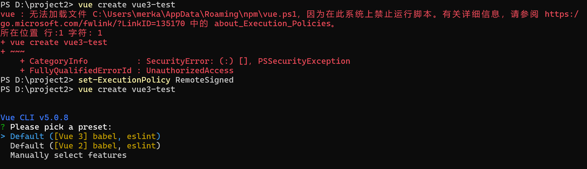
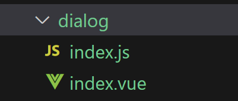

# 学习Vue
vue-cli，axios，vue-router，vuex

## jquery与vue区别
```
jquery 事件驱动
vue 数据驱动
```
## 更新变化
```
1、双向数据绑定原理改变
//vue2用的是Object.defineProperty()仅能监听对象属性的变化，对象有多个属性，需要给对象的每个属性都绑定这个方法

//vue3用的是Proxy，Proxy可以直接监听对象变化，而不是属性，还可以监听数组的变化，性能比Object.defineProperty()好

2、新出了一个组合式api
组合式api方式，主要就是已setup()钩子函数体现，让我们不必向以前那样写代码，
如：数据必须写在data里，操作data数据里方法得写在methods里的，
这样写，操作的数据少还行，要是多了，会导致代码很难阅读，
数据和方法没有写在一起，代码很不内聚，
为了解决这个问题，出了这个组合式api，这个就是比较省事，在setup方法，
里定义数据，定义方法，然后暴露出去，就可以使用
补充：之前数据定义在data，操作数据的方法定义在methods里，这种方式叫选项式api

3、声明周期函数变化
beforeDestroy -> beforeUnmount
destroyed -> unmounted

4、组件内新增一个emits定义方式
可以用这个来验证子传父时，验证数据是否正确

5、vue3支持碎片（Fragments）
vue2组件模板template仅支持存在一个根节点(元素)，现在vue3组件模板template支持存在多个根节点(元素)

<template>
  <div>vue2仅支持存在一个根节点</div>
</template>

<template>
  <div>vue3支持存在多个根节点</div>
  <div>vue3支持存在多个根节点</div>
</template>


6、创建实例的方式不一样
//vue2
new Vue({
	el:"#app",
	data(){return {}}
})

//vue3
Vue.createApp({
	data(){return {}}
}).mount("#app");

7、脚手架创建项目命令变化 
脚手架2版本：vue init webpack 项目名
脚手架最新版：vue create 项目名

8、启动项目的命令发生变化
npm run dev -> npm run serve

9、脚手架 项目目录变化
static -> public
删除了config，build配置脚手架文件，最新版用vue.config.js代替了

10、vue3版本引用的vue-router/vuex它们的创建方式发生变化
vue3引用的vue-router创建是通过createRouter创建的，之前是直接new Router()
vue3引用的vuex创建是通过createStore创建的，之前是vuex.store方法创建
```
## MVVM设计模式
```
MVVM是一种软件设计模式，vue，react都是基于这种设计模式

MVVM把 UI用户界面 与 业务逻辑 分开，这样开发者只需关注，业务逻辑，不需要操作dom

MVVM 是 Model-View-ViewModel 的缩写

Model 业务逻辑相关的数据对象
View 视图层，负责将数据转化成UI展现出来
ViewModel 是 Model 和 View 的连接器

在MVVM架构下，View 和 Model 之间并没有直接的联系，
而是通过 ViewModel 进行交互，
ViewModel 负责将 Model 中的数据同步到 View，并将 View 中的用户交互操作同步到 Model。
```
## Vue响应式原理
```
通过Object.defineProperty()劫持数据属性的访问和修改，与 发布订阅者模式，实现数据的响应式更新。实现数据和视图之间的自动同步关系。这种机制大大简化了数据绑定和事件处理的代码量，提高了开发效率和代码可读性。

在初始化阶段，Vue会遍历data中的所有属性，并使用Object.defineProperty()把这些属性全部转为getter/setter。
在getter中，Vue会追踪依赖，即在组件渲染过程中，使用过的数据会被getter收集为依赖；
在setter中，当数据变化时，会触发依赖的更新，即通知watcher重新渲染关联的组件。

采用 数据劫持 结合 发布者-订阅者模式 的方式
通过Object.defineProperty()来劫持监听data里各个属性的setter，getter，
当数据发生变动时 通知 订阅者 变化。
```
## Vue双向数据绑定原理
```
Vue双向数据绑定原理基于 Vue响应式原理。

实现 数据变化自动同步到视图，视图变化自动更新到数据 的双向绑定。
```
## Object.defineProperty 和 Proxy
1、Object.defineProperty
```javascript
var aValue = 0
var obj = {}
//当对象中不存在指定的属性时，可根据属性名，为对象创建一个新的属性
Object.defineProperty(obj, "a", {
  set: function (newValue) {
    console.log("监听到给a赋值:" + newValue);
    aValue = newValue;
  },
  get: function () {
    console.log("监听到要读取a的值");
    return aValue;//这里不写return，下面obj.a时将会打印undefined
  }
})
obj.a = 9999;//将触发set方法
console.log(obj.a);//将触发get方法
```

2、Proxy
```javascript
var obj = {}
//new一个Proxy，然后返回一个代理对象
var proxyObj = new Proxy(obj,{
	set:function(target,attr,value){
		console.log('111');
		target[attr] = value;
	},
	get:function(target,attr,receiver){
		console.log('222');
		return target[attr];
	}
})
proxyObj.name = 123;//触发set方法
console.log(proxyObj.name);//get方法
obj.name = 456;//值可以修改，但不会触发set方法
console.log(obj.name);//值可以获取，但不会触发get方法
```
## 设置npm镜像源地址
```
https://registry.npmjs.org      npm官方镜像地址
https://registry.npm.taobao.org 淘宝镜像地址(地址已失效)
https://registry.npmmirror.com  国内最新镜像地址

npm config set registry https://registry.npmmirror.com   //设置npm镜像源地址
npm config get registry //获取npm镜像源地址
```
## 获取和设置npm全局 npm_cache地址
```
npm config get cache		//获取地址
npm config set cache [地址]	//设置地址
```
## 获取和设置npm全局 node_global地址
```
npm config get prefix           //获取地址
npm config set prefix [地址]    //设置地址
```
## npm安装模块

"-g"表示安装到全局

"--save"表示安装包时，会把包的信息记录到package.json文件中（dependencies）下

"--save-dev"表示安装包时，会把包的信息记录到package.json文件中（devDependencies）下

在安装包时，不加 -g，--save，--save-dev 默认会执行 --save 的操作

保证 项目正常运行/生产环境 需要的包，请将包信息记录到（dependencies）下

项目开发时需要的一些工具包，如单元测试包，请将包信息记录到（devDependencies）下。项目生产打包时，不会将记录在（devDependencies）下的包 打包进去

```
npm install 模块名
```
## 查看版本
```
vue -V //注意大写的V
```
## 安装脚手架2版本
```
npm install vue-cli -g //安装脚手架2版本脚手架的命令
```
## 卸载脚手架2版本
如果是全局安装的脚手架，卸载时后面跟“-g”
```
npm uninstall vue-cli -g //卸载脚手架2版本的命令
```
## 脚手架2版本创建一个项目
```
vue init webpack 项目名称
```
## 脚手架2版本启动项目
```
npm run dev
```
## 安装脚手架3或更高版本
```
npm install @vue/cli -g
```
## 卸载脚手架3或更高版本
```
npm uninstall @vue/cli -g
```
## 脚手架3或更高版本创建一个项目
```
vue create 项目名称

上下键 切换选择项
空格键 是否选中/取消选中
回车键 确认(next)
```
## 脚手架3或更高版本启动项目
```
npm run serve
```
## 项目打包命令
```
npm run build
```
## 脚手架2版本解决开发环境跨域问题
1、修改项目 config/index.js 文件
```javascript
module.exports = {
    dev: {
        //Paths
        assetsSubDirectory: 'static',
        assetsPublicPath: '/',

        //解决跨域问题
        proxyTable: {
            '/api': {                       //匹配的路径								
                target: "http://xxx.com",   //跨域的地址
                changeOrigin: true,         //允许跨域
                pathRewrite: {
                    '^/api': '/xpg'         //路径重写：请求地址 /api/abc 转化成 /xpg/abc
                }
            }
        },
        //...
    }
    //...
}
```
## 脚手架3或更高版本解决开发环境跨域问题
1、最新版脚手架创建的项目删除了config，build配置脚手架的文件，最新版用vue.config.js代替了
```javascript
module.exports = {
    //解决打包后访问不到资源文件的问题
    publicPath: process.env.NODE_ENV == 'production' ? './' : '/',

    //解决跨域问题
    devServer: {
        open: true,
        proxy: {
            '/api': {
                target: 'http://localhost:80/', //设置你调用的接口域名和端口号 别忘了加http
                changeOrigin: true,             //允许跨域
                pathRewrite: {
                    '^/api': '/xpg'             //路径重写：请求地址 /api/abc 转化成 /xpg/abc
                }
            }
        }
    }
}
```
## 创建项目报错 系统禁止运行脚本
```
set-ExecutionPolicy RemoteSigned
```


## VSCode里Vue代码高量插件
```
vetur 针对vue2版本
volar(Vue - Official) 针对vue3版本
```
## v-if和v-show
v-if,在html中是否加载（创建）元素
```html
<div v-if="true">已加载</div>
```
v-show,为元素设置display属性
```html
<div v-show="true">已显示</div>
```
## v-for
```html
for in 与 for of 区别： for in 可以渲染数组或对象 for of 只能渲染数组，for in遍历的是键或坐标，for of遍历的是值

<span v-for="(item, index) in arr">{{ item }},{{ index }}</span>

<span v-for="(item, index) of 99" v-if="item != 2">{{ item }}</span>
<!-- 注意：这个循环是从1开始的 -->
<!-- 注意2：v-for 与 v-if 写在一个元素里，这时v-for的优先级高于v-if，在这里v-if会失效 -->

<!--解决上面的问题，v-for写在template模板标签上，这个template模板标签是个空的占位符，不会被渲染到页面上-->
<template v-for="(item, index) of 99">
  <span v-if="item != 2">{{ item }}</span>
</template>
```
## v-text和v-html
因为使用{{data}}这种方式直接在页面内渲染数据，在网页加载慢的时候会出现会直接把{{}}直接渲染出来，所以为了避免这种问题推荐使用以下两种方式

v-text功能等于innerText
```html
<span v-text="data"></span>
```
v-html功能等于innerHTML
```html
<span v-html="data"></span>
```
## v-on 绑定事件
v-on:click等于@click
```html
<div v-on:click="name='新名字'">{{name}}</div>
<div v-on:click="fun">{{name}}</div>
<div v-on:click="fun(),fun2()">{{name}}</div>
<!--绑定多个事件，方法名后面在这里必须加上括号-->
```
事件修饰符
```html
1、stop修饰符 阻止事件向父级事件冒泡
e.stopPropagation()
<div @click="handle1">
  <button @click.stop="handle">我是按钮</button>
  <!--点击这个按钮只会触发handle方法，不会触发handle1方法-->
</div>

2、prevent修饰符 阻止元素默认行为
e.preventDefault()
<button type="submit" @click.prevent="handle">我是按钮</button>
<!--这时点击 我是按钮 只会单纯触发handle方法。不会有form表单的提交行为-->

3、self修饰符 只有点击自己的时候才会被执行
<div @click.self="handle1">
  aaaaa
  <!--点击aaa时只会触发handle1方法，不会触发handle方法-->
  <button @click="handle">我是按钮</button>
  <!--这时点击 我是按钮 handle1方法不会被触发-->
</div>

4、capture修饰符 改成捕获模式，默认冒泡模式
<div @click.capture="handle1">
  <button @click="handle">我是按钮</button>
  <!--经测试，点击我是按钮，会先触发handle1方法，然后在触发handle方法-->
  <!--经测试，如果capture绑定在handle方法上，这时点击我是按钮，会先触发handle方法，然后在触发handle1方法-->
</div>

5、once修饰符 事件只执行一次
<button @click.once="handle">我是按钮</button>
<!--这时点击我是按钮，会先触发一次handle1方法，在次点击就不会触发方法-->
```
## v-model 双向数据绑定
```html
<input type="text" v-model="name"><!--结果：输入的内容-->
<input type="checkbox" v-model="thisValue"><!--结果：true或false-->
<input type="radio" value="我被选中了" v-model="thisValue"><!--结果：value值-->
```
v-model修饰符
```html
1、lazy修饰符 用户按回车 或 失去焦点时才将数据写到data中
<input type="text" v-model.lazy="text">

2、number修饰符 将用户输入的数值字符串转成成数值
<input type="text" v-model.number="num">

3、trim修饰符 去除字符串两边多余的空格
<input type="text" v-model.trim="text">
```
## v-bind 绑定元素属性
v-bind:href等于:href
```html

```
## 绑定行内样式
```html
<h1 :style="{'background':background,'font-size':'100px'}">I am Index</h1>
<!--绑定样式 不包引号则为data里属性-->
<h1 :style="h1Style">I am Index</h1>
<!--绑定样式 不包引号则为data里属性
data(){
  return {

    h1Style: {
      background: "red"
    }
    
  }
}
-->
```
## 绑定class样式
```html
<h1 :class="'normalWeight'">I am Index</h1>
<!--有引号，为style，class样式名-->

<h1 :class="normalWeight">I am Index</h1>
<!--没有有引号，为data数据的属性名，需要data里有normalWeight这个属性-->
```
## 三元运算符和绑定多个样式
```html
方式1 通过数组
<div v-bind:class="[isActive ? 'activeClass' : 'errorClass', 'content']"></div>
<!--如果isActive为true，则渲染style样式'activeClass'，否则渲染style样式'errorClass'。不论isActive是true还是false，style样式'content'一直都渲染-->

方式2 通过对象
<div v-bind:class="{'styleClassName1':true,'styleClassName2':false}"></div>
<!--因为styleClassName1后面是true，所以这时这个div会被添加一个名为styleClassName1的class样式。因为styleClassName2后面是false，所以这时这个div不会添加一个名为styleClassName2的样式-->
```
## vue代码结构
```javascript
export default {
  name: "demo",
  beforeCreate() {
    //初始化了一个空的Vue实例对象，这时只有一些默认的生命周期和默认事件，其它东西都未创建
    //这时data和methods中的数据没有初始化
    console.log("beforeCreate");
  },
  created() {
    //这时data和methods都已初始化好了
    //如果要调用methods中的方法或操作数据，最早只能在created中操作
    console.log("created");
  },
  beforeMount() {
    //这时模板已经在内存中编译好了，但尚未挂载到页面中去，此时页面还是旧的
    console.log("beforeMount");
  },
  mounted() {
    //这时整个vue实例已经初始化完毕，此时组件已经脱离创建阶段进入到运行阶段
    console.log("mounted");
  },
  beforeUpdate() {
    //这时页面中的数据还是旧的，但data中的数据是最新的
  },
  updated() {
    //这时页面中的数据和data中的数据都是最新的
  },
  beforeDestroy() {
    //这时vue实例已从运行阶段，进入到销毁阶段
    //这时data和methods以及过滤器，指令等都处在可用状态
    console.log("beforeDestroy");
  },
  destroyed() {
    //这时组件已经完全销毁，组件中的数据、方法、指令、过滤器等都已经不可用
    console.log("destroyed");
  },
  beforeUnmount() {
    //vue3生命周期，用来代替2生命周期beforeDestroy，调用app.unmount()可触发该生命周期
    console.log("beforeDestroy");
  },
  unmounted() {
    //vue3生命周期，用来代替2生命周期destroyed，调用app.unmount()可触发该生命周期
    console.log("unmounted");
  },
  data() {
    return {
      aaa: "home",
      count: 0,
      obj: {a: 1},
    }
  },
  methods: {
    addCount() {
      this.count++;
    },
  },
  computed: {
    //计算属性
    countBB() {
      //调用当前方法返回当前count的值加1后的结果。所以顾名思义“计算属性”
      return this.count + 1;
    },
  },
  watch: {
    //监听属性
    count: function (newValue, oldValue) {
      //当count发生变化时执行
      //newValue最新的值
      //oldValue旧的值
    },
    //watch的一个特点是，最初绑定的时候是不会执行的，要等到属性改变时才执行监听
    obj: {
      handler(newValue, oldValue) {
        console.log(newValue);
      },
      immediate: true, //初次绑定时，就执行handler方法
      deep: true, //实现深度监听,一般情况下，给obj重新赋值也就是obj的这个引用发生变化，watch才能监听到，
      //但开启deep后修改a的值也能监听到，因为vue也给obj.a加上了监听，但是如果obj有好多key，开启后，会损耗性能
    },
  },
};
```
## methods与computed与watch的区别
```
1、methods 方法
methods有些时候，可以干和computed一样的事，但在使用methods方法时，每次使用都需要重新执行方法，这点没有computed好。而在使用computed计算属性的时候，会优先读取缓存，而不是重新运算。当computed计算属性所依赖的数据发生变化时，computed计算属性会自动变化，而不是等到调用时才变化

2、computed 计算属性
当某一个数据受多个数据影响时，这时用计算属性
计算属性有缓存。如某个数据被计算后，会被存入缓存里。如依赖的数据没有发生变化，使用数据时是直接从缓存里拿。只有当依赖的数据有发生变化时，这个数据才会被重新计算
computed内不适合做异步操作
computed方法内必须得写return

3、watch 监听
当某一条数据影响多条数据的时候，使用watch
watch某些时候，可以干和computed一样的事，但是需要额外的在data里定义一个属性来接收值，watch监听数据发生变化，每次变化都需要重新执行方法，这点没有computed好
watch内可以做异步操作，如某个数据发生变化后，重新调用接口
```
## computed计算属性里的get，set

vue computed默认写法下是没有set方法的，只有get方法

```html
<template>
    <div>result：{{ result }}</div>
</template>
<script>
export default {
    data() {
        return {
            a: 20,
            b: 100,
        }
    },
    mounted() {
        console.log(this.result);
        //打印如下内容：
        //1、get方法执行了（这个其实在调用console.log(this.result)之前就被打印出来了，也就是vue加载好后就调用了get方法，然后把结果存入了vue缓存里）
        //2、120
        
        this.result = '10 20';
        //打印如下内容：
        //1、set方法执行了
        //2、get方法执行了
     
        //vue检测到result被修改，于是调用set方法，打印 set方法执行了，并且把 10 和 20 分别赋值给 a 和 b，vue检测到计算result所依赖的 a 和 b 被修改了，于是重新触发get方法，打印 get方法执行了，并且把计算出来的新的 result 的值渲染到页面上
    },
    computed: {
        result: {
            get() {
                console.log('get方法执行了');
                return this.a + this.b;
            },
            set(value) {
                console.log('set方法执行了');
                let arr = value.split(' ')
                this.a = arr[0]
                this.b = arr[1]
            }
        }
    }
};
</script>
<style scoped></style>
```
# 组件
## 父组件和子组件生命周期函数执行顺序
```
加载渲染过程：
父 beforeCreate -> 父 created -> 父 beforeMount -> 子 beforeCreate -> 子 created -> 子 beforeMount -> 子 mounted -> 父 mounted

子组件更新过程：
父 beforeUpdate -> 子 beforeUpdate -> 子 updated -> 父 updated

父组件更新过程：
父 beforeUpdate -> 父 updated

销毁过程：
父 beforeDestroy -> 子 beforeDestroy -> 子 destroyed -> 父 destroyed
```
## vue组件
```javascript
//vue2写法
Vue.component('base-board', {
  template: `<div>1111</div>`
});


//vue3写法
const app = Vue.createApp({
  template: `
    <h1>Vue3实例</h1>
    <a1 /><!--全局组件-->
    <base-board /><!--局部组件-->`,
  components: {
    baseBoard //这里局部组件需要在这里绑定一下，才能使用。这里虽然是驼峰写法，但在html中使用时，需要转换成<base-board />这里因为在js变量中不能使用 “ - ”，html组件可以使用。这样做可以有个区分
  }
})
app.$mount('#app');//挂载vue3实例

//vue3全局组件，只要定义了，处处可以使用，性能不高，但是使用起来简单。为什么性能不高，全局组件就是你一旦定义了，就会占用系统资源，不管你用不用
app.component('a1', {
  template: `<h1>我是全局组件</h1>`
});

//vue3局部组件，定义了，不占资源。只有使用了才占资源
const baseBoard = {
  template: `<div>局部组件</div>`
};
```
## 组件单向数据流
```
单向数据流概念：父级 prop 的更新会向下流动到子组件中，但是反过来则不行
有单向数据流，可以防止从子组件意外改变父级组件的状态，从而防止你应用的 数据流 难以理解

一个被多次复用的子组件，子组件改变了引用的父组件数据，没有单项数据流机制，其它子组件的数值也跟着变化，这会让页面内这个多次被复用的子组件的数据耦合在一起，没办法独立使用
```
## 父向子传值props

定义组件
```javascript
Vue.component('base-board', {
  props: ['value'],//使用props方式1
  props: {//使用props方式2
    value: {
      type: String,//注意，这里String两边没有单引号啥的
      required: true,//是否必填
      default: 'abc',//默认参数，当数据为 对象 或 数组 时，默认值需要以一个工厂函数返回，如: default:function(){return {"a":1}}
      validator(a) {//自定义检验方法，上面type检验类型，这里可以在加一些自定义判断，如value值必须是‘abc’
        console.log(a);
        return a == 'abc'
      }
    }
  },
  template: `<div>{{value}}</div>`
})
```
使用组件
```html
<!--v-bind绑属性值-->
<base-board v-bind:value="值"></base-board>
```
## 子组件自定义事件$emit

定义组件
```javascript
Vue.component('base-button', {
  data: function () {
    return {}
  },
  props: ['value'],
  emits: ['子组件自定义事件名1'],//vue3新增，不是必须写，这是一个类似props的东西，主要是定义子组件自定义事件。vue2不需要。
  emits: {//emits写法2，子传父的值进行自定义校验。如，这时如果这个value小于10，则会被警告
    '子组件自定义事件名1'(value) {
      return value > 10 ? true : false
    }
  },
  template: `<div>{{value}}</div>
		<button v-on:click="diaoyong">按钮</button>`,
  methods: {
    diaoyong: function () {
      //触发子组件自定义事件
      this.$emit('子组件自定义事件名1'[, 传递的参数])
    }
  }
})
```
使用组件
```html
<base-button v-on:子组件自定义事件名1="父组件里方法名"></base-button>
```
## 在父组件中使用子组件中的方法或数据


```html
<!--父组件-->
<template>
  <div>这里是父组件</div>

  <baseButton ref="baseButton" />
</template>

<script>
//引入子组件
import baseButton from "./BaseButton.vue";
export default {
  components: {
    baseButton
  },
  mounted() {
    this.$baseButton = this.$refs.baseButton;

    this.$baseButton.alert("wang", 1); //调用子组件里方法
    console.log(this.$baseButton.a); //打印子组件中data里的数据 120
  }
};
</script>


<!--子组件BaseButton.vue-->
<template>
  <div>我是子组件</div>
</template>

<script>
export default {
  data: function () {
    return {
      a: 120,
    };
  },
  methods: {
    alert(name, value) {
      console.log("触发子组件中的方法");
      console.log(name, value);
    }
  }
};
</script>
```

## 组件插槽（slot）

定义组件
```javascript
//一个插槽
Vue.component('baseButton', {
  template: `
  <div>
      <p>我是组件</p>
      <slot></slot>
  </div>`
})

//多个插槽
Vue.component('baseButton', {
  template: `
  <div>
      <p>我是组件</p>
      <slot name="one"></slot> //多个插槽需要在slot标签上指定name来区分
      <slot name="two"></slot>
  </div>`
})
```
使用组件
```html
<!--一个插槽-->
<base-button>
  <p>我是插槽内容</p>
</base-button>

<!--多个插槽-->
<base-button>
  <template v-slot:one>
    <p>我是插槽内容one</p>
  </template>
  <template v-slot:two>
    <p>我是插槽内容two</p>
  </template>
</base-button>
```
## 组件Non-props特性

给子组件v-bind绑数据，子组件如果不props接收数据，绑的数据会变成子组件的属性，子组件接收了数据就不会变成子组件的属性。这也就是为什么可以给组件或标签绑定style样式。

定义组件
```javascript
Vue.component('baseButton', {
  template: `<div>123</div>`
})
```
使用组件
```html
<!--假如value1这时是1，且base-button组件没有props接收这个index值，则这个index会变成属性-->
<base-button :index="value1"></base-button>
```
渲染结果
```html
<div index="1">123</div>
```
## 自定义组件使用v-model
定义组件
```javascript
Vue.component('pengInput', {
  props: ["value"],
  template: `
	<input
	v-bind:value="value"
	v-on:input="$emit('input',$event.target.value)"
	/>`
})
```
使用组件
```html
<peng-input v-model="input_text"></peng-input>
```
## 组件修饰符.sync
```html
<!--父组件-->
<template>
  <div>父组件</div>
  <!--通过修饰符.sync，子组件可以更方便的向父组件传输数据。不用通过之前接收事件的方式传输数据。这种其实是之前(emit,props)的语法糖-->
  <child-component :value.sync="faterValue" />
</template>
<script>
//引入子组件
import childComponent from "./childComponent.vue";
export default {
  components: {
    childComponent
  },
  data() {
    return {
      faterValue:456
    }
  }
};
</script>


<!--子组件childComponent.vue-->
<template>
  <div>我是子组件</div>
  <button @click="updateData">更新数据</button>
</template>
<script>
export default {
  props: ["value"],
  data: function () {
    return {}
  },
  methods: {
    updateData(){
      //因为value是通过.sync绑定进来的，所以可以使用下面，这种方式更新value
      this.$emit('update:value',123)
    }
  }
};
</script>
```
## 组件属性name 可自己调用自己
```html
<!--父组件-->
<template>
  <div>
    <nav-list :haveChild="true"/>
  </div>
</template>
<script>
import navList from './navList.vue'
export default {
  components:{
    navList
  }
};
</script>


<!--子组件navList.vue-->
<template>
  <div>
    <!--子组件里通过属性name="navList"，自己调用自己-->
    <nav-list :haveChild="false"/>
  </div>
</template>
<script>
export default {
  name:"navList",
  props:{
    haveChild:{
      type:Boolean,
      default:false
    }
  }
};
</script>
```
## provide/inject实现嵌套组件之间的数据传输
```
provide() 和 inject() 可以实现嵌套组件之间的数据传递。
这两个函数只能在 setup() 函数中使用。
父级组件中使用 provide() 函数向下传递数据。
子级组件中使用 inject() 获取上层传递过来的数据。
不限层级，嵌套组件之间可跨层传递。
注意，只能是父传子。不能子传父。
```
```html
<!--父组件-->
<script>
import { provide } from 'vue'
import ChildComp from './ChildComp.vue'
export default {
  components:{
    ChildComp
  },
  setup(){
    provide('msg','msg from father')
  }
}
</script>

<template>
  <ChildComp />
</template>


<!--子组件ChildComp.vue-->
<script>
import { inject } from 'vue'
export default {
  setup(){
    console.log(inject('msg'))//msg from father
  }
}
</script>

<template>
  <h2>A Child Component!</h2>
</template>
```

## vue动画
css样式
```css
/*打开过渡时 enter-active */
.slide-fade-enter-active {
  transition: all 0.5s;
}
/*关闭过渡时 leave-active */
.slide-fade-leave-active {
  transition: all 0.15s linear;
}
/*打开开始时 enter，关闭结束时 leave-to */
.slide-fade-enter,
.slide-fade-leave-to {
  transform: translateY(100px);
  opacity: 0.5;
}
```
使用
```html
<transition name="slide-fade">
  <span v-if="isPageShow"></span>
</transition>
```

## vue里使用axios
1、在项目内创建一个文件夹request

2、在文件夹内创建一个index.js文件

request/index.js
```javascript
import axios from 'axios';

//import store from '@/store' //导入 vuex

/*
if (process.env.NODE_ENV == 'development') {
  //开发环境
  axios.defaults.baseURL = '';
} else if (process.env.NODE_ENV == 'debug') {
  //测试环境
  axios.defaults.baseURL = '';
} else if (process.env.NODE_ENV == 'production') {
  //生产环境
  axios.defaults.baseURL = '';
}
*/

// 请求url公共部分
axios.defaults.baseURL = 'https://192.168.31.95';

// 请求超时时间
axios.defaults.timeout = 10000;

// post请求头
axios.defaults.headers.post['Content-Type'] = 'application/x-www-form-urlencoded;charset=UTF-8';

// 配置token
axios.defaults.headers.common['Authorization'] = 'token_value';

// 请求拦截器
axios.interceptors.request.use(function (config) {
    // console.log(config);
    return config;
}, function (error) {
    return Promise.reject(error);
});

// 响应拦截器
axios.interceptors.response.use(function (response) {
    if (response.status === 200) {
        return Promise.resolve(response.data);
    } else {
        return Promise.reject(response);
    }
},
    // 服务器状态码不是200的情况    
    function (error) {
        if (error.response.status) {
            //error.response.status  401,403,404
            return Promise.reject(error.response);
        }
    }
);
export default axios;
```
vue main.js
```javascript
//vue2配置方式
import a_request from './request';
Vue.prototype.$request = a_request;

//vue3配置方式
import a_request from './request'
const app = createApp(App)
app.config.globalProperties.$request = a_request
app.mount('#app')
```
项目中使用
```javascript
export default {
    name: 'home',
    mounted() {
        //get请求
        this.$request({
            url: '/api/getData',
            method: 'GET',
            params: {
                'a': 10,
                'b': 20
            },
            headers: { 'yourHeaderFeild': '1111' },//自定义请求头参数
        }).then(function (data) {
            console.log(data)
        }).catch(function (err) {
            console.log(err)
        });


        //post请求
        this.$request({
            url: '/api/postData',
            method: 'POST',
            data: {
                'a': 1000,
                'b': 2000
            },
            headers: { 'yourHeaderFeild': '1111' },//自定义请求头参数
        }).then(function (data) {
            console.log(data)
        }).catch(function (err) {
            console.log(err)
        });
    }
}
```
如上请注意：post方式自定义请求头信息，会触发**复杂请求**。复杂请求会在post请求之前，会向服务端发送一个OPTIONS的请求权限信息的请求，来向服务端要服务端的请求权限信息。拿到服务端的请求权限信息后，浏览器会将这个与post方式的请求头，请求方式，请求域名进行检验。如果满足条件发送post请求，如不满足会触发跨域，不会进行post请求。[Nodejs处理复杂请求](https://github.com/fengfanv/JS-library/tree/master/node#node处理复杂请求)


### vue里使用axios的小窍门

把所有接口都写在一个js文件内，方便管理接口

在request文件夹下创建一个query.js文件，并写下如下代码：
```javascript
//query.js文件
import request from './index.js';

export function queryOrder(orderid) {
    let params = new URLSearchParams();//解决post方式后台接收不到参数问题
    params.append("orderid", orderid);
    return request({
        url: 'http://localhost:5000/queryOrder',
        method: 'POST',
        data: params
    }).then(function (res) {
        return Promise.resolve(res);
    }).catch(function (err) {
        return Promise.reject(err);
    });
}

export function queryOrder2(data) {
    return request({
        url: 'http://localhost:5000/queryOrder2',
        method: 'POST',
        data
    })
}

//...
```
在项目中使用
```html
<template>
  <div></div>
</template>
<script>
import { queryOrder } from "../request/query.js";
export default {
  data: function () {
    return { a: 1 };
  },
  mounted() {
    queryOrder(this.a).then((res) => {
      console.log(res);
    }).catch((err) => {
      console.log(err);
    })
  },
};
</script>
```
## vue-router使用
1、在项目内创建一个文件夹router

2、在文件夹内创建一个index.js文件

index.js
```javascript
//vue2版本
import Vue from 'vue'
import Router from 'vue-router'

import home from '@/components/home'
import index from '@/components/index'

Vue.use(Router)

const router = new Router({
  routes: [
    //重定向的地址
    { path: '/', redirect: '/home' },
    //普通路由地址
    //跳转到home组件
    {
      path: '/home',
      name: 'home',
      component: home,
      //可以在路由配置中增加钩子函数，beforeEnter(路由独享守卫)
      beforeEnter (to, from, next) {
        // ...
        next()
      }
    },
    //跳转到index组件
    {
      path: '/index/:id',//:id配置路由匹配的参数
      name: 'index',
      component: index
    }
  ]
})

//路由钩子函数
//1、全局前置守卫（跳转前执行）
router.beforeEach((to, from, next) => {
  console.log('to:',to);//要到哪里去
  console.log('from:',from);//从什么地方来

  //next() 与next(true)意思一样允许跳转
  //next(true/false) false不允许跳转
  //next('/another') 重定向到指定路由  

  if (to.path === '/index') {//当地址为/index时做处理
    if (to.query.id !== undefined) {
      console.log('有id值，继续');
      next();
    } else {
      console.log('无id值，跳转login页面');
      next('/login');
    }
  } else {
    next();
  }
})

//2、全局解析守卫（执行在 beforeEach 与 afterEach 之间）
router.beforeResolve((to, from, next) => {
  console.log('before resolve invoked')
  next()
})

//3、全局后置守卫（跳转后执行）
router.afterEach((to, from) => {
  console.log('after each invoked')
})

export default router

//路由钩子函数分三大类：全局守卫、独享守卫，组件内守卫
//路由钩子函数执行顺序：
/*
1、全局前置守卫(beforeEach(to,from,next))
在跳转前调用

2、路由独享的守卫(beforeEnter(to,from,next))
在路由配置中单独定义，针对特定路由的导航守卫

3、组件内的守卫1(beforeRouteEnter(to,from,next))
在路由进入组件之前调用（此时组件实例尚未被创建，因此不能访问this）

4、组件内的守卫2(beforeRouteUpdate(to,from,next))
在当前路由改变，但是该组件被复用时调用。

5、组件内的守卫3(beforeRouteLeave(to,from,next))
导航离开该组件的对应路由时调用

6、全局解析守卫(beforeResolve(to,from,next))

7、全局后置守卫(afterEach(to,from))
跳转后执行
*/

//vue3版本
import { createRouter, createWebHashHistory } from 'vue-router'
import Home from '../views/Home.vue'

const routes = [
  {
    path: '/',
    name: 'Home',
    component: Home
  }
]

const router = createRouter({
  history: createWebHashHistory(),
  routes
})
export default router
```
vue main.js
```javascript
//vue2版本
//引入router配置
import Vue from 'vue'
import App from './App'
import router from './router'

new Vue({
  el: '#app',
  router,//挂载到vue里
  components: { App },
  template: '<App/>'
})


//vue3版本
import { createApp } from 'vue'
import App from './App.vue'
import router from './router'

createApp(App).use(router).mount('#app')
```
项目中使用
```javascript
this.$router.push({"path":'/home'});//地址    /home

this.$router.go(-1);//和JavaScript里的history.go(-1)功能基本一样

this.$router.replace("/home");//跟 router.push 很像，不同的是，它不会向 history 添加新记录，而是跟它的方法名一样，会替换掉当前的 history 记录

this.$router.push({"path":'/home',query:{"a","123"}});//地址    /home?a=123

this.$router.push({"name":'index',params:{"id","123"}});//地址    /home/123   使用这种需要预先配置好，才能使用

this.$route.query  //获取query里面传过来的值

this.$route.params  //获取params里面传过来的值
```
## vuex使用
1、在项目内创建一个文件夹store

2、在文件夹内创建一个index.js文件

index.js
```javascript
//state：存储的数据(状态)，在项目中使用 this.$store.state.参数名

//getters：可以将getters理解为vuex的计算属性，getters的返回值会被缓存起来，只有当它依赖的数据发生改变时才会被重新计算。在项目中使用 this.$sotre.getters.方法名

//mutations：官网建议专门用来修改数据(状态)，mutations的方法里仅支持同步的方法（如：在方法里面不能使用setTimeout这种异步操作）。在项目中使用 this.$store.commit('方法名',params)

//actions：官方不建议我们直接调用mutations下方法来改数据，所以提供了另一种方法，主要用于调用mutations下的方法，actions里可以使用异步操作（如：在actions的方法里面可以使用setTimeout等，区别上面mutations），在项目中使用 this.$store.dispatch('方法名',params)

//modules：由于使用单一状态树，web应用的所有状态会集中到一个比较大的对象。当应用变得非常复杂时，store对象就会变得很臃肿。为了解决这个问题，vuex允许我们将store分割成模块(module)。每个模块拥有自己的state、mutation、action、getter


//vue2版本
import Vue from 'vue'
import Vuex from 'vuex'

Vue.use(Vuex)

const store = new Vuex.Store({
    state: {
        count: 0
    },
    getters: {
        getStateCount: function (state) {
            return state.count + 1;
        }
    },
    mutations: {
        addCount(state, n = 0) {
            state.count += n;
        }
    },
    actions: {
        addFun: function (context, value) {
            context.commit("addCount", value);
        },
        //actions可以使用promise返回值（区别于mutations，mutations里不可以使用promise返回值）
        //调用时 this.$store.dispatch('promiseTest',123).then((res)=>{console.log(res)})
        promiseTest: function (context, value) {
            return new Promise((resolve, reject) => {
                resolve('啦啦啦')
            })
        }
    }
})
export default store


//vue3版本
import { createStore } from 'vuex'

export default createStore({
  state: {},
  mutations: {},
  actions: {},
  modules: {}
})
```
vue main.js
```javascript
//vue2版本
//引入
import Vue from 'vue'
import App from './App'
import store from './store'

new Vue({
  el: '#app',
  store,
  components: { App },
  template: '<App/>'
})


//vue3版本
import { createApp } from 'vue'
import App from './App.vue'
import store from './store'

createApp(App).use(store).mount('#app')
```
在项目中使用
```javascript
//直接获取state值
this.$store.state.count;

//从getters获取的数据
this.$store.getters.getStateCount;

//调用mutations里方法修改数据
this.$store.commit("addCount",1);

//调用actions下方法
this.$store.dispatch("addFun",1);
```
### vuex里模块（modules）

index.js
```javascript
import { createStore } from 'vuex'

import app from './app_modules'

export default createStore({
  state: {},
  mutations: {},
  actions: {},
  modules: {
    app
  }
})
```
app_modules.js
```javascript
export default {
    namespaced: true, //开启命名空间。默认情况下，模块内部的 action 和 mutation 是注册在全局命名空间内的，这样可以使得多个模块能够对同一个 action 或 mutation 作出响应。getter 同样也是默认注册在全局命名空间，所以必须要注意，不要在不同的、无命名空间的模块中定义两个相同的 getter 从而导致错误。
    //namespaced: true 使其成为带命名空间的模块，当模块被注册后，它的所有 getter、action、mutation 都会自动根据模块注册的路径调整命名
    state() {
        return {
            //在页面中使用 this.$store.state.app.count
            count: 0
        }
    },
    mutations: {
        //在页面中使用 this.$store.commit('app/set_value',18)
        set_value(state, value) {
            state.count = value
        }
    },
    actions: {
        //在页面中使用 this.$store.dispatch('app/set_value_async',18)
        set_value_async({ state, commit, rootState }, value) {
            state.count = value;
        },
        //在页面中使用 this.$store.dispatch('app/set_value_1',18)
        set_count_1({ state, commit, dispatch, rootState }, value) {
          //调用当前模块里的其它dispatch，调用时不用写 app/set_value_async，写 set_value_async 就可以
          dispatch('set_value_async',18)
          //调用其它模块里的dispatch，调用时需要写全 xxx/set_value
          dispatch('xxx/set_value',18,{root:true})
        }
    },
    getters: {
        //在页面中使用 this.$store.getters['app/get_value']
        get_value(state, getters, rootState) {
            return state.count + 'a'
        }
    }
}
```
### vuex辅助函数
```html
<script>
import { mapState, mapGetters, mapMutations, mapActions } from 'vuex'
export default {
  computed:{
    ...mapState(['a']), //将 this.$store.state.a 变成 this.a
    ...mapGetters(['aGetterValue']) //将 this.$store.getters.aGetterValue 变成 this.aGetterValue
  },
  methods:{
    ...mapMutations(['setValue']), //将 this.$store.commit('setValue',value) 变成 this.setValue(value)
    ...mapActions(['disSetValue']) //将 this.$store.dispatch('disSetValue',value) 变成 this.disSetValue(value)
  }

  //模块
  computed: {
    ...mapState('aa', ['count']), //将 this.$store.state.aa.count 变成 this.count
    ...mapGetters('aa', ['getters_value']) //将 this.$store.getters['aa/getters_value'] 变成 this.getters_value
  },
  methods: {
    ...mapMutations('aa', ['set_value']), //将 this.$store.commit('aa/set_value',value) 变成 this.set_value(value)
    ...mapActions('aa', ['dis_set_value']) //将 this.$store.dispatch('aa/dis_set_value',value) 变成 this.dis_set_value(value)
  }
}
</script>
```
## 组件缓存keep-alive

```
keep-alive是vue内置的一个组件，而这个组件的作用就是能够缓存不活动的组件，我们能够知道，一般情况下，组件进行切换的时候，默认会进行销毁，如果有需求，某个组件切换后不进行销毁，而是保存之前的状态，那么就可以利用keep-alive来实现

使用keep-alive后，组件或页面内能使用的钩子函数：

1、activated
第一次进入某个页面的时候，页面或组件内，钩子触发的顺序是 beforeCreate -> created -> BeforeMount -> mounted -> activated
第二次进入（打开过这个页面，跳到别的页面去了，现在又跳回来了），页面或组件内，钩子触发的顺序是 activated（当再次进入，这个缓存的页面或组件时候，只触发activated）

2、deactivated ：离开页面的时候会触发deactivated，不会触发页面或组件的卸载生命周期钩子（如beforeUnmount，unmounted）
```
App.vue
```html
<template>
  <router-view v-slot="{ Component }">
    <keep-alive>
      <component :is="Component" v-if="$route.meta.keepAlive" />
    </keep-alive>
    <component :is="Component" v-if="!$route.meta.keepAlive" />
  </router-view>
</template>

<style>
nav {
  padding: 30px;
}

nav a {
  font-weight: bold;
  color: #2c3e50;
}
</style>
```
router/index.js
```javascript
import { createRouter, createWebHashHistory } from 'vue-router'
const routes = [
    //重定向的地址
    { path: '/', redirect: '/a' },
    {
        path: '/a',
        name: 'a',
        component: () => import ('../pages/a.vue'),
        meta: {
            keepAlive: true //根据meta属性里的keepAlive来判断，这个页面用不用进行缓存
        }
    },
    {
        path: '/b',
        name: 'b',
        component: () => import ('../pages/b.vue'),
        meta: {
            keepAlive: false
        }
    }
]
const router = createRouter({
    history: createWebHashHistory(),
    routes
})
export default router
```

## 组合式API (Composition API)

声明响应式状态 ref() / reactive()
```
声明响应式状态，声明式渲染，通过扩展标准 HTML 的语法，我们可以根据 JavaScript 的状态来描述 HTML 应该是什么样子的。当状态改变时，HTML 会自动更新。能在改变时触发更新的状态被称作是响应式的。我们可以使用 ref() / reactive() 来声明响应式状态。

---

ref可以接受任何数据类型，但主要用于包装JavaScript的基本类型数据（如字符串、数字、布尔值等）。
reactive用于包装对象和数组等复杂类型的数据。它不能包装（如字符串、数字、布尔值等）这样的基本类型数据。

在js里，访问或修改ref声明的值，需要通过 .value 属性来访问或修改。因为在ref接收参数后，会将其包裹在一个带有 .value 属性的 ref对象 中。
在模板template中使用ref声明的值，不需要通过 .value 属性。

当ref的值是一个对象时，ref会在内部调用reactive，但使用时仍需要通过 .value 属性来访问或修改。
```
组合式API &lt;script setup&gt;
```html
<script setup>
import { ref } from 'vue'

//使用ref声明一个响应式状态
const count = ref(0)

//在js里使用ref，需要加 .vlaue 属性
console.log(count.value)

</script>

<template>
    <!--注意，在模板template中使用ref时，不需要附加 .value 属性-->
    <button @click="count++">
        {{ count }}
    </button>
</template>
```
组合式API中使用计算属性(computed)
```html
<script setup>
import { ref, computed } from 'vue'

const a1 = ref('a1')
const a2 = ref('a2')

const a3 = computed(() => {
    return a1.value + ' ' + a2.value
})
</script>

<template>
  <div>
    <p>a1：{{a1}}</p>
    <p>a2：{{a2}}</p>
    <p>a3：{{a3}}</p>
  </div>
</template>
```
```html
<script setup>
import { ref, computed } from 'vue'

const a1 = ref('a1')
const a2 = ref('a2')

const a3 = computed({
  get() {
    return a1.value + ' ' + a2.value
  },
  set(newValue) {
    [a1.value, a2.value] = newValue.split(' ')
  }
})
a3.value = 'xiao zhang'
</script>

<template>
  <div>
    <p>a1：{{a1}}</p>
    <p>a2：{{a2}}</p>
    <p>a3：{{a3}}</p>
  </div>
</template>
```
组合式API中使用侦听器(watch)
```html
<script setup>
import { ref, watch } from 'vue'

const todoId = ref(1)
const todoData = ref(null)

watch(todoId, async () => {
    const res = await fetch(`https://jsonplaceholder.typicode.com/todos/${todoId.value}`)
    todoData.value = await res.json()
}, {
    immediate: true,
    //deep: true
})
</script>

<template>
    <p>todoId: {{ todoId }}</p>
    <button @click="todoId++">Fetch next todo</button>
    <pre>{{ todoData }}</pre>
</template>
```
组合式API中使用组件(components)
```html
<!--父组件-->
<script setup>
import { ref } from 'vue'

import ChildComp from './ChildComp.vue'
  
const parentMsg = ref('msg from parent')
const childMsg = ref('No child msg')
</script>

<template>
  <p>右边这条消息，是从子级传来的：{{ childMsg }}</p>
  <hr>
  <ChildComp @response="(msg)=>childMsg=msg" :msg="parentMsg" />
</template>


<!--子组件 ChildComp.vue-->
<script setup>
//注意defineProps()是一个编译时宏，并不需要导入，可直接使用。
const props = defineProps({
  msg: String
})

const emit = defineEmits(['response'])
emit('response', 'msg from child')
</script>

<template>
  <h2>这里是子组件</h2>
  <p>右边这条消息，是从父级传来的：{{msg}}</p>
</template>
```
组合式API中DOM元素模板引用(ref)
```html
<script setup>
import { ref, onMounted } from 'vue'

//要访问在DOM里ref模板引用，我们需要在js里声明一个同名的ref
const pElementRef = ref(null)
onMounted(()=>{
  console.log(pElementRef.value.textContent)//hello
})
</script>

<template>
  <p ref="pElementRef">hello</p>
</template>
```
组合式API中插槽(slot)
```html
<!--父组件-->
<script setup>
import { ref } from 'vue'

import ChildComp from './ChildComp.vue'

const msg = ref('msg from parent')
</script>
<template>
  <ChildComp>{{msg}}</ChildComp>
</template>


<!--子组件 ChildComp.vue-->
<template>
    <!--如果插槽内没有值，则下面这个 Fallback content 是插槽的默认内容-->
    <slot>Fallback content</slot>
</template>
```
组合式API中使用vue-router
```html
<script setup>
import { useRoute, useRouter } from 'vue-router'

const route = useRoute()
console.log(route.query)

const router = useRouter()
router.push({path:"/about"})

</script>
```
组合式API中使用vuex
```html
<script setup>
import { ref } from 'vue'
import { useStore } from 'vuex'

const bbb = ref('bbb1')

//注意 这里不是 $store
const store = useStore();
console.log(store.state.a);
store.state.a = bbb.value;
</script>

<template>
  <!--注意 在template模板里使用，还是 $store.state.a-->
  <p>{{ $store.state.a }}</p>
</template>
```
组合式API setup() 钩子函数

setup() 执行时，组件实例尚未被创建，这时组件内 data，computed，methods 还不能使用。

在 setup() 方法里，因为 setup() 方法是运行在解析数据方法之前，所以 setup() 方法里的this和普通vue里this是不一样的，因此在setup方法里调用this，是无法操控组件里数据和方法。

```html
<script>
import { ref } from 'vue'

export default {
  setup(){
    //使用ref声明一个响应式状态
    const count = ref(0)
    
    //在js里使用ref，需要加 .vlaue 属性
    console.log(count.value)
    
    //将声明的响应式状态 暴露给模板
    return {
      count
    }
  }
}
</script>

<template>
    <!--注意，在模板template中使用ref时，不需要附加 .value 属性-->
    <button @click="count++">
        {{ count }}
    </button>
</template>
```
组合式API setup() 父子组件
```html
<!--父组件-->
<script>
import { ref } from 'vue'

import ChildComp from './ChildComp.vue'

export default {
  components:{
    ChildComp
  },
  setup(){
    const parentMsg = ref('msg from parent')
    const childMsg = ref('No child msg')
    
    return {
      parentMsg,
      childMsg
    }
  }
}
</script>

<template>
  <p>右边这条消息，是从子级传来的：{{ childMsg }}</p>
  <hr>
  <ChildComp @response="(msg)=>childMsg=msg" :msg="parentMsg" />
</template>


<!--子组件 ChildComp.vue-->
<script>
export default {
  props:{
    msg: String
  },
  emits: ['response'],
  setup(props, context) {
    console.log(props.msg)
    context.emit('response', 'msg from child')
  }
}
</script>

<template>
  <h2>这里是子组件</h2>
  <p>右边这条消息，是从父级传来的：{{msg}}</p>
</template>
```
组合式api组件声明周期函数

|  选项式api   | 组合式api  |
|  ----        | ----      |
| beforeCreate | 无        |
| created      | 无        |
| beforeMount  | onBeforeMount |
| mounted      | onMounted     |
| beforeUpdate | onBeforeUpdate |
| updated      | onUpdated      |
| beforeUnmount | onBeforeUnmount |
| unmounted     | onUnmounted     |

## 利用Vue.extend实现全局插件

插件目录结构



插件模板组件（plugin/alert.vue）
```html
<template>
    <div v-if="isShow">
        alert组件
        <button @click="onButtonOk()">确认</button>
    </div>
</template>

<script>
export default {
    name: "alert",
    data() {
        return {
            isShow: false,
        }
    },
    methods: {
        onButtonOk() {
            //给调用的地方返回一个提示
            this.callback && this.callback('你单击了确定按钮')
        },
        callback() { }//代绑定的callback
    }
};
</script>
<style scoped></style>
```
插件配置文件（plugin/index.js）
```javascript
import alertFrom from './alert.vue'

export default {
  install: function (Vue, options) {
    //利用扩展实例构造器生成一个Vue的子类
    const alert2 = Vue.extend(alertFrom);
    //生成一个该子类的实例
    const alert_content = new alert2();
    //将这个实例挂载在我创建的div上
    alert_content.$mount(document.createElement('div'));
    //并将此div加入全局挂载点内部
    document.body.appendChild(alert_content.$el);
    //在vue原型上写方法，调用使
    Vue.prototype.alert_main = {
      showAlert: function (callback) {
        alert_content.isShow = true;
        //给插件模板里绑一个回调函数，
        //可利用callback向使用的地方返回参数
        //可利用callback执行一些业务操作
        alert_content.callback = callback;
      },
      hideAlert: function (callback) {
        alert_content.isShow = false;
        alert_content.callback = callback;
      }
    }
  }
}
```
在（main.js）中进行绑定
```javascript
import Vue from 'vue'

import alertPopups from '@/plugin/index.js'
Vue.use(alertPopups)
```
在纯js文件中使用
```javascript
import Vue from 'vue'

Vue.alert_main.showAlert(function (data) {
  //通过绑定callback，返回某些操作后需要返回的信息

  //也可以利用callback，执行某些操作
  //比如这是个弹窗插架，你需要在单击插架ok按钮后执行某些操作
  //这时，你可以利用callback来执行这些操作。
});
```
在vue文件中使用
```html
<template></template>
<script>
export default {
  mounted(){
    this.alert_main.showAlert(function (data) {
      //回调函数
    })
  }
}
</script>
```
## 其它问题
#### vue里render渲染函数
```html
内容待补充


```
#### import与import()区别是什么
```
1、import

静态加载，在代码编译时就运行，不能在写在代码块里，export和import命令只能在模块的顶层

如：以下代码，会报错，因为import xxx from 'xxx'命令会被JS引擎静态分析，先于模块内的其他语句执行，套在外面的if不会被执行，所以会报错
if (true) {
  import xxx from 'xxx'
}


2、import() 
动态加载，会返回一个Promise对象，一般用于组件懒加载

如：const Index = () => import('../pages/index.vue');
```
#### export & import 数据引用

1、基本数据类型，不能修改，是拷贝值

2、引用类型数据，可以修改，是引用值

a.js
```javascript
import * as b from './b.js';

console.log(JSON.stringify(b));
/*
{
	name: "I am b",
	say: say(),
	skills: ["aaa","bbb","ccc"]
}
*/

b.name = 'bbb';//报错，报错内容就是不让改
b.skills.push('ddd')

console.log(JSON.stringify(b))
/*
{
	name: "I am b",
	say: say(),
	skills: ["aaa","bbb","ccc","ddd"]
}
*/

b.say()
/*
I am b
["aaa", "bbb", "ccc", "ddd"]
*/
```
b.js
```javascript
var name = 'I am b'
var skills = ['aaa','bbb','ccc']
var say = function(){
    console.log(name);
    console.log(skills);
}
export {name,skills,say}
```

#### 在methods的方法内改变data里面object类型数据
```javascript
export default {
  name: "test",
  data() {
    return {
      username: 'Ian',
      id: 1,
      check: {
        account: "",
        password: ""
      }
    }
  },
  methods: {
    change() {
      this.$set(this.check, "account", "");//改变check下account的值
    }
  }
}
```
#### 想在data的某个属性下使用data中的某个数据
```html
<template>
  <div>hahah</div>
</template>
<script>
var vm = null; //设置
export default {
  name: "index",
  created() {
    vm = this;
  },
  data: function () {
    return {
      name: "aaa",
      content: {
        key: vm.name, //通过使用全局变量方法，为content.key赋值
      },
    };
  },
  mounted() {},
  methods: {},
};
</script>
<style scoped>
</style>
```
#### vue服务器渲染（ssr），区分当前是浏览器环境还是node环境
```html
<template>
  <div>hahah</div>
</template>
<script>
var vm = null;
var node = true;
if (process.browser) {
  //浏览器环境
  node = false;
}
export default {
  name: "index",
  created() {
    vm = this;
  },
  data: function () {
    return {};
  },
  mounted() {},
  methods: {},
};
</script>
<style scoped>
</style>
```
## Vue-API  Vue.config.devtools
获取vue2环境当前是开发环境还是生产环境
```javascript
//javascript
console.log(Vue.config.devtools);
//true:开发环境
//false:生产环境
```