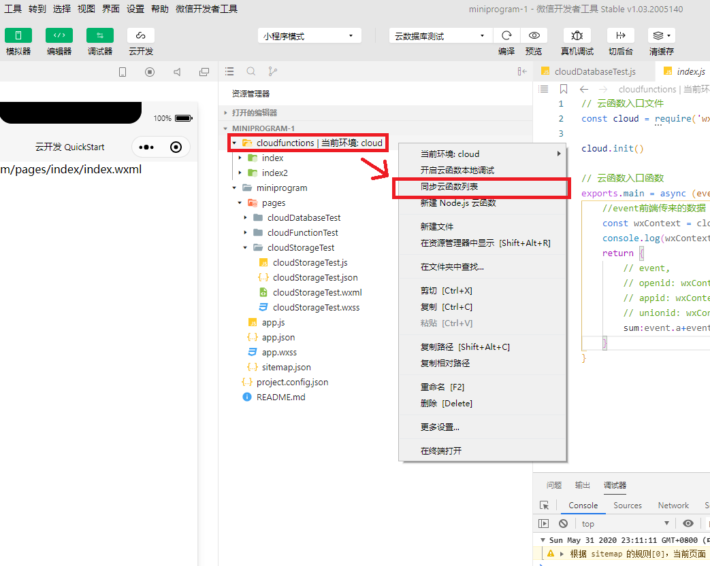

# 微信小程序及云开发

## 微信小程序
#### 小程序页面配置
[框架 -> 小程序配置](https://developers.weixin.qq.com/miniprogram/dev/reference/configuration/app.html)

#### 小程序生命周期
[框架 -> 框架接口 -> 页面 -> page](https://developers.weixin.qq.com/miniprogram/dev/reference/api/Page.html)

[指南 -> 小程序框架 -> 逻辑层 -> 注册页面](https://developers.weixin.qq.com/miniprogram/dev/framework/app-service/page.html)
```javascript
Page({
  data: {
    text: "This is page data."
  },
  onLoad: function(options) {
    // 页面创建时执行
  },
  onShow: function() {
    // 页面出现在前台时执行
  },
  onReady: function() {
    // 页面首次渲染完毕时执行
  },
  onHide: function() {
    // 页面从前台变为后台时执行
  },
  onUnload: function() {
    // 页面销毁时执行
  },
  onPullDownRefresh: function() {
    // 触发下拉刷新时执行
  },
  onReachBottom: function() {
    // 页面触底时执行
  },
  onShareAppMessage: function () {
    // 页面被用户分享时执行
  },
  onPageScroll: function() {
    // 页面滚动时执行
  },
  onResize: function() {
    // 页面尺寸变化时执行
  },
  onTabItemTap(item) {
    // tab 点击时执行
    console.log(item.index)
    console.log(item.pagePath)
    console.log(item.text)
  },
  // 事件响应函数
  viewTap: function() {
    this.setData({
      text: 'Set some data for updating view.'
    }, function() {
      // this is setData callback
    })
  },
  // 自由数据
  customData: {
    hi: 'MINA'
  }
})
```
#### 检测当前是否为pc电脑端
```javascript
wx.getSystemInfo({
  success(res) {
    let system = res.system;
    if (/(windows|mac|win)/i.test(system)) {
      console.log('当前是pc端')
    }
  },
});
```
#### 使用下拉刷新
```javascript
//1、在页面pageName.json文件里添加"enablePullDownRefresh":true开启下拉刷新
//2、在页面内使用onPullDownRefresh生命周期函数，监听页面下拉操作

//wx.startPullDownRefresh();//api调用下拉生命周期函数
//wx.stopPullDownRefresh();//更新完毕，关闭下拉
```
#### 在电脑端设置大屏 或 手机端设置横屏
```javascript
//设置pc大屏，在项目的app.json中设置"resizable": true（PC是否支持用户任意改变窗口大小）属性

//设置手机横屏，在项目app.json中window中设置"pageOrientation":"auto"（屏幕旋转设置）
```
#### 小程序全局配置(app.json)和页面配置(pageName.json)

[框架 -> 小程序配置 -> 全局配置](https://developers.weixin.qq.com/miniprogram/dev/reference/configuration/app.html)

[框架 -> 小程序配置 -> 页面配置](https://developers.weixin.qq.com/miniprogram/dev/reference/configuration/page.html)

#### 绑定多个class或style
```html
<view class="login_view1 button {{isLogin?'login_button':''}}">
<view style="font-size:18px;{{'color:'+dataColor}};">
```
#### 动态设置导航栏背景色及文字颜色1（API -> 界面 -> 导航栏）
```javascript
wx.setNavigationBarColor({
  frontColor: "#ffffff", //文字颜色只能是黑（#000000）或白（#ffffff）
  backgroundColor: "#ff0000",
});
```
#### 设置导航栏背景色及文字颜色2
```javascript
//1、设置项目app.json文件
{
  pages: [],
  window: {
    navigationStyle: "default", //default 默认样式。custom 自定义导航栏，只保留右上角胶囊按钮
    navigationBarBackgroundColor: "#F6F6F6",
    navigationBarTitleText: "",
    navigationBarTextStyle: "black",
  },
};

//2、设置页面下页面的json文件
{
  navigationBarTitleText: "Change",
  navigationBarBackgroundColor: "#ffffff",
  navigationBarTextStyle: "black",
};
```
#### app.json设置背景注意事项
```javascript
backgroundColor //设置的是小程序背景色，这个是下拉刷新时能看到的那个背景色

要设置页面背景色那个背景色，则需要设置css，如下：
page {
  background-color: #f7f7f7;
}
```
#### 使用 wx:if（框架 -> WXML语法参考）
```html
<view class="login_view" wx:if="{{login}}">
```
#### 使用 wx:for（框架 -> WXML语法参考）
[wx:for文档](https://developers.weixin.qq.com/miniprogram/dev/reference/wxml/list.html)
```html
<!--默认情况下，不用指定wx:for-index 与 wx:for-item，默认下为item与index，想自定义可以指定-->
<view wx:for="{{array}}" wx:for-index="idx" wx:for-item="itemData">
  {{idx}}: {{itemData.message}}
</view>
```
#### 在标签内动态插入html元素 类似v-html的功能

小程序里没有v-html这样的指令，需要借用 rich-text 标签
```html
<!--
这时htmlData里数据为："我是<span style='color:red'>Fengfanv</span>"
-->
<rich-text nodes="{{htmlData}}"></rich-text>
```
#### 使用 button 按钮（组件 -> 表单组件）
[button文档](https://developers.weixin.qq.com/miniprogram/dev/component/button.html)
```html
<button open-type="getUserInfo">微信登录</button>
```
#### 使用 input 按钮（组件 -> 表单组件）
[input文档](https://developers.weixin.qq.com/miniprogram/dev/component/input.html)
```html
<input class="weui-input" maxlength="10" placeholder="最大输入长度为10" />
```
#### 单向数据绑定和双向数据绑定（指南 -> 小程序框架 -> 简易双向数据绑定）

单向。可在js里通过this.setData()改变value1的值，input里也会跟着变化。但是修改input里的值，不会影响data里value1
```html
<input value="{{value1}}" />
```
双向
```html
<input model:value="{{value1}}" />
```
#### 绑定事件
[事件系统文档](https://developers.weixin.qq.com/miniprogram/dev/framework/view/wxml/event.html)
```html
<view bindtap="handlerName">
    Click here!
</view>
```
给方法绑定数据
```html
<view bindtap="handlerName" data-keyname="11"></view>
<!--keyname就是绑定的数据名字，11是keyname的值-->
```
在方法内取这个数据
```javascript
Page({
	handlerName(e){
		console.log(e.currentTarget.dataset.keyname) //打印 11
	}
}
```
阻止事件冒泡

冒泡   从里向外

除 bind 外，也可以用 catch 来绑定事件。与 bind 不同， catch 会阻止事件向上冒泡。

例如，在下边这个例子中，点击 inner view 会先后调用handleTap3和handleTap2(因为tap事件会冒泡到 middle view，而 middle view 阻止了 tap 事件冒泡，不再向父节点传递)，点击 middle view 会触发handleTap2，点击 outer view 会触发handleTap1。
```html
<view id="outer" bindtap="handleTap1">
  outer view
  <view id="middle" catchtap="handleTap2">
    middle view
    <view id="inner" bindtap="handleTap3">
      inner view
    </view>
  </view>
</view>
```

#### 请求用户openid

前端代码（API -> 开放接口 -> 登录 -> wx.login）

[前端api文档](https://developers.weixin.qq.com/miniprogram/dev/api/open-api/login/wx.login.html)


```javascript
page({
  //登录方法
  onlogin() {
	  
    wx.login({
      success(res) {
        if (res.code) {
          //请求后端接口，用code换openid
          wx.request({
            url: "https://www.xxx.cn:1000/api/onlogin",
            method: "get",
            data: {
              code: res.code,
            },
            success: function (data) {
              //后端请求成功
            },
            fail: function (err) {
              //后端请求失败
            }
          });
        } else {
          //console.log('登录失败！' + res.errMsg);
        }
      }
    });
	
  },
});
```
后端代码（服务端 -> 登录 -> auth.code2Session）

[后端api文档](https://developers.weixin.qq.com/miniprogram/dev/api-backend/open-api/login/auth.code2Session.html)
```javascript
//Node.js
const https = require("https");

//微信用户登录，用code换openid
function getUserOpenid(code) {
  return new Promise(function (resolve, reject) {
    const option = {
      hostname: "api.weixin.qq.com",
      protocol: "https:",
      port: 443,
      method: "GET",
      path:
        "https://api.weixin.qq.com/sns/jscode2session?appid=123456789&secret=123456789&js_code=" +
        code +
        "&grant_type=authorization_code",
    };
    const request = https.request(option, function (response) {
      let data = "";
      response.on("data", function (chunk) {
        data += chunk;
      });
      response.on("end", function () {
        resolve(data);
      });
    });
    request.on("error", function (err) {
      reject("换取 openid 失败！");
    });
    request.end();
  });
}

```
#### 写入和读取本地缓存（API -> 数据缓存）
[本地缓存api文档](https://developers.weixin.qq.com/miniprogram/dev/api/storage/wx.setStorageSync.html)
```javascript
//如：写入本地缓存
//这是异步方法，同步方法见文档
wx.setStorage({
  key:"key",
  data:"value"
})

//如：读取本地缓存
//这是异步方法，同步方法见文档
wx.getStorage({
  key: 'key',
  success (res) {
    console.log(res.data)
  }
})

//清楚本地缓存
//这是异步方法，同步方法见文档
wx.clearStorage()
```
#### 选择图片（API -> 媒体 -> 图片 -> wx.chooseImage）
```javascript
page({
	getImage(){
		wx.chooseImage({
		  success (res) {
		    // tempFilePath可以用在img标签的src属性 来显示图片
		    const tempFilePaths = res.tempFilePaths
		  }
		})
	}
});
```
#### 发送网络请求（API -> 网络 -> 发起请求 -> wx.request）
[wx.request文档](https://developers.weixin.qq.com/miniprogram/dev/api/network/request/wx.request.html)
```javascript
page({
	postMessage(){
		wx.request({
		  url: 'test.php', //仅为示例，并非真实的接口地址
		  data: {
		    x: '',
		    y: ''
		  },
		  header: {
		    'content-type': 'application/json' // 默认值
		  },
		  success (res) {
		    console.log(res.data)
		  }
		})
	}
});
```
#### 上传文件（API -> 网络 -> 上传 -> wx.uploadFile）
[上传文件api文档](https://developers.weixin.qq.com/miniprogram/dev/api/network/upload/wx.uploadFile.html)
```javascript
wx.chooseImage({
  success (res) {
    const tempFilePaths = res.tempFilePaths
    wx.uploadFile({
      url: 'https://example.weixin.qq.com/upload', //仅为示例，非真实的接口地址
      filePath: tempFilePaths[0],
      name: 'file',
      formData: {
        'user': 'test'
      },
      success (res){
        const data = res.data
        //do something
      }
    })
  }
})
```
#### 跳转页面/路由（API -> 路由 -> wx.navigateTo）
[wx.navigateTo文档](https://developers.weixin.qq.com/miniprogram/dev/api/route/wx.navigateTo.html)

#### 页面之间使用事件监听 来 相互传输数据

a页面
```javascript
wx.navigateTo({
  url: 'b?id=1',//通过地址传参
  events: {
    //为指定事件添加一个监听器，获取被打开页面传送到当前页面的数据
    'b页面发送给a页面的数据的方法名': function(data) {
      console.log(data)
    }
  },
  success: function(res) {
    //通过eventChannel向被打开页面传送数据
    res.eventChannel.emit('a页面发送给b页面的数据的方法名', { data: 'test' })
  }
})
```
b页面
```javascript
Page({
  onLoad: function(option){
    console.log(option.query)//打印a页面通过地址传过来的参数


    const eventChannel = this.getOpenerEventChannel()
    //向a页面发送数据
    eventChannel.emit('b页面发送给a页面的数据的方法名', {data: 'test'});
    //监听‘a页面发送给b页面的数据的方法名’事件，获取上一页面通过eventChannel传送到当前页面的数据
    eventChannel.on('a页面发送给b页面的数据的方法名', function(data) {
      console.log(data)
    })
  }
})
```
#### 使用 app.js 内 globaldata（全局变量）
```javascript
//app.js
App({
	onLaunch: function () {
		
		//...
		
		this.globalData = {
			name:"Ian"
		}
	}
})
```

```javascript
//index/index.js
//获取应用实例
const app = getApp();//这是使用全局变量的关键
Page({
	onLoad: function (options) {
		console.log(app.globalData.name);//"Ian"
		app.globalData.name = "Lee";
		console.log(app.globalData.name);//"Lee"
	}
});

```

#### 自定义组件开发（开发 -> 指南 -> 自定义组件）

[自定义组件文档](https://developers.weixin.qq.com/miniprogram/dev/framework/custom-component/)

##### 项目内使用自定义组件
```javascript
//1、在项目里创建组件页面，在这个组件页面内的json文件里添加 "component": true 用于声明组件
//2、组件编写完成后，在项目中使用
```
##### 组件的html文件
```html
<view class="showState {{animationName}}">
    <view class="icon color1" wx:if="{{state==1}}"></view>
    <view class="icon color2" wx:if="{{state==2}}"></view>
    <view class="icon color3" wx:if="{{state==3}}"></view>
    <view class="text">{{text}}</view>
	<!--slot用于承载组件引用时提供的子节点-->
	<!--单个slot-->
	<slot></slot>
	
	<!--多个slot-->
	<slot name="one"></slot>
	<slot name="two"></slot>
</view>
```
##### 组件的js文件
```javascript
Component({
    options: {
        multipleSlots: true //在组件定义时的选项中启用多slot支持
    },
    //组件的属性列表
    properties: {
        state: {
            type: 'Number',
            value: 0,//默认值
            observer(newValue, oldValue) {
                //属性值变化时的回调函数
                console.log('state新值',newValue);
                console.log('state旧值',oldValue);
                this.setData({
                    state: newValue
                });
            }
        },
        text: {
            type: 'String',
            value: '成功',//默认值
            observer(newValue, oldValue) {
                console.log('text新值：' + newValue);
                console.log('text旧值：' + oldValue);
                this.setData({
                    text: newValue
                });
                this.toShow();
            }
        }
    },
    data: {
        state: 0,//0不显示，1成功，2失败，3异常
        text: '成功',
        animationName: ''
    },
    methods: {
        setValue(state, text) {
            let _this = this;
            console.log('设置value值');
            _this.setData({
                state,
                text
            })
            this.toShow();
        },
        toShow() {
            let _this = this;
            _this.setData({
                animationName: 'toShow'
            })
            setTimeout(() => {
                console.log('执行关闭');
                _this.toHide();
            }, 2000)
        },
        toHide() {
            let _this = this;
            _this.setData({
                animationName: 'toHide'
            });
            //所有要带到主页面的数据，都装在eventDetail里面
            var eventDetail = {
                name: 'sssssssss',
                test: [1, 2, 3]
            }
            //触发事件的选项 bubbles是否冒泡，composed是否可穿越组件边界，capturePhase是否有捕获阶段
            var eventOption = {
                composed: true
            }
            this.triggerEvent('hide', eventDetail, eventOption)
        }
    }
})
```
##### 组件在项目页面中使用
```javascript
//在需要引入组件的页面内json文件中添加，如下：
"usingComponents": {
    "showState": "/components/showState/showState"
}
//添加完毕后方可使用
```
在页面中使用
```html
<!--使用properties中的属性state，text-->
<!--监听methods的toHide方法里this.triggerEvent触发的自定义组件事件-->
<showState state="3" text="更新异常" onhide="onhide" id="showState">
	<!--单个slot使用，直接放进组件里就行-->
	<view>使用slot</view>
</showState>

<!--多个slot使用-->
<showState>
	<view slot="one">使用slot_one</view>
	<view slot="two">使用slot_two</view>
</showState>
```
使用组件中的方法
```javascript
Page({
    data: {},
    onLoad: function (options) {
		
		this.$showState = this.selectComponent('#showState');
		
		this.$showState.setValue(1,'更新成功')//使用showState中的方法
		
    }
});
```
## 云开发
#### 配置云开发

**在小程序里使用云数据库，云存储，云函数需要在app.js键入以下内容**

```javascript
//app.js
App({
  onLaunch: function () {
    
    if (!wx.cloud) {
      console.error('请使用 2.2.3 或以上的基础库以使用云能力')
    } else {
      wx.cloud.init({

        //env 参数说明：
        //env 参数决定接下来小程序发起的云开发调用（wx.cloud.xxx）会默认请求到哪个云环境的资源
        //此处请填入环境 ID, 环境 ID 可打开云控制台查看
        //如不填则使用默认环境（第一个创建的环境）

        //env: 'my-env-id',
        traceUser: true,
      })
    }

    this.globalData = {}
  }
})
```
#### 云数据库基本操作（增删改查）
```javascript
// miniprogram/pages/index/index.js
Page({
    data: {},
    onLoad: function (options) {
		
    },
    //请求云数据库某集合(表)的数据
    getCloudDatabase() {
        //获取数据库引用
        const db = wx.cloud.database();
        const tabel1 = db.collection('tabel1')
        //请求写法方式1
        // tabel1.get({
        //     success:function(res){
        //         console.log(res);
        //     },
        //     fail:function(err){
        //         //请求数据出错！
        //         console.log(err);
        //     }
        // })
        //请求写法方式2,promise方式
        tabel1.get().then(function (res) {
            console.log(res);
        }).catch(function (err) {
            console.log(err);
        })
    },
    //请求数据库中某个集合(表)的某条数据1
    getCloudDatabaseWhere() {
        const db = wx.cloud.database();
        const tabel1 = db.collection('tabel1');
        tabel1.where({ "name": "wangtao" }).get().then(function (res) {
            console.log(res)
        }).catch(function (err) {
            console.log(err);
        })
    },
    //请求数据库中某个集合(表)的某条数据2
    getCloudDatabaseWhere2() {
        const db = wx.cloud.database();
        const list = db.collection('list');
        list.where({ "job": "web" }).get().then(function (res) {
            console.log(res)
        }).catch(function (err) {
            console.log(err);
        })
    },
    //给数据库中某个集合(表)插入一条数据
    addCloudDatabase() {
        const db = wx.cloud.database();
        const tabel1 = db.collection('tabel1');
        tabel1.add({
            data: {
                "name": "lilei"
            }
        }).then(function (res) {
            console.log(res)
        }).catch(function (err) {
            console.log(err);
        })
    },
    //更新数据库中集合(表)的某条记录的数据
    updateCloudDatabase() {
        const db = wx.cloud.database();
        const tabel1 = db.collection('tabel1');
        //这doc是记录中的 _id 
        //这有个问题，只能改变通过代码方式添加的数据，直接在库里建的记录不行(因为直接在库里建的记录没有自动生成_id)
        // tabel1.doc('38d78ca75ed1d6c80008f1df68d7d5fd').update({
        //     data:{
        //         name:'齐天大圣'
        //     }
        // }).then(function(res){
        //     console.log(res);
        // }).catch(function(err){
        //     console.log(err);
        // })

        //更新集合(表)中某个记录的多个key的值
        //这有问题，报错，这个好像只能修改通过代码上传的，直接在库里建的记录不能操作
		//这doc里的字符串是记录随机生成的_id
        tabel1.doc('4c5846c75ed1deb00008b66e08450e4b').set({
            data: {
                name: '孙悟空',
                job: "保唐僧西天取经"
            }
        }).then(function (res) {
            console.log(res);
        }).catch(function (err) {
            console.log(err);
        })

    },
    //删除集合(表)中某条记录
    delList() {
        const db = wx.cloud.database();
        const tabel1 = db.collection('tabel1');
		//这doc里的字符串是记录随机生成的_id
        tabel1.doc('4c5846c75ed1deb00008b66e08450e4b').remove().then(function (res) {
            console.log(res);
        }).catch(function (err) {
            console.log(err);
        })
    }
});
```
#### 云存储基本操作（上传文件下载文件删除文夹）
```javascript
Page({
    data: {
        imageUrl: ''
    },
    onLoad: function (options) {
        
    },
    //获取图片
    getImage() {
        let _this = this;
        wx.chooseImage({
            complete: (res) => {
                console.log(res);
                if (res.tempFiles != undefined && res.tempFiles.length >= 1) {
                    //有图片
                    //获取图片信息
                    wx.getImageInfo({
                        src: res.tempFiles[0].path,
                        success(res2) {
                            //console.log(res.width)
                            //console.log(res.height)
                            //console.log(res2);
                            _this.setData({
                                imageUrl: res.tempFiles[0].path,
                                imageSize: res.tempFiles[0].size,
                                imageType: res2.type
                            })
                        }
                    })
                }
            },
        })
    },
    //上传图片
    uploadImage(){
        let _this = this;
        wx.cloud.uploadFile({
            filePath:_this.data.imageUrl,//被上传的文件地址
            cloudPath:Date.now()+'.'+_this.data.imageType,//这里设置上传后，在云库里的地址，需要设置文件类型，否则无法显示
            success(res){
                console.log(res);
            },
            fail(err){
                console.log(err);
            }
        })
    },
    //下载云存储的文件
    downloadCloudFile(){
        wx.cloud.downloadFile({
            fileID:"cloud://cloud110.636c-cloud110-1302251157/1590820377274.png",
            success(res){
                console.log(res);
            },
            fail(err){
                console.log(err);
            }
        })
    },
    //删除云存储里的文件
    delCloudFile(){
        wx.cloud.deleteFile({
            fileList:['cloud://cloud110.636c-cloud110-1302251157/1590820377274.png'],
            success:function(res){
                console.log(res);
            },
            fail:function(err){
                console.log(err);
            }
        })
    }
});
```
#### 云函数基本操作

右键单击 cloudfunctions|xxx环境

然后点击 新建node.js云函数


创建云函数完毕后 再右键单击 cloudfunctions|xxx环境

然后点击 同步云函数列表 (这样是为了防止，开发时前端调用，找不到云函数方法的问题)



最后在创建好的云函数index.js文件里写业务代码

```javascript
//index.js
//云函数入口文件
const cloud = require('wx-server-sdk')

cloud.init()

//云函数入口函数
exports.main = async (event, context) => {
    //event前端传来的数据

    const wxContext = cloud.getWXContext()
    console.log(wxContext);
    
    //把数据返回给前端
    return {
        // event,
        // openid: wxContext.OPENID,
        // appid: wxContext.APPID,
        // unionid: wxContext.UNIONID,
        sum:event.a+event.b
    }
}
```

将写好的云函数部署到云上

右键点击 你创建的这个云函数文件夹

然后选择 上传并部署:云端安装依赖(不上传node_modules)


#### 云函数操作数据库
```javascript
//index.js
//云函数入口文件
const cloud = require('wx-server-sdk')

cloud.init({
    //配置云数据库
    traceUser:true,
    env:"云端id"
})

//引用数据库
const db = cloud.database();

//云函数入口函数
exports.main = async (event, context) => {
    const wxContext = cloud.getWXContext()

    // return {
    //     event,
    //     openid: wxContext.OPENID,
    //     appid: wxContext.APPID,
    //     unionid: wxContext.UNIONID,
    // }

    return new Promise(function(resolve,reject){
		//云函数里操作数据库和在小程序里直接操作数据差不多
		//获取tabel1集合(表)的数据
        db.collection('tabel1').get().then(function(res){
            resolve(res)
        }).catch(function(err){
            reject(err)
        })
    })
}
```
#### 小程序里使用云函数
```javascript
Page({
    data: {},
    onLoad: function (options) {},
    shiyong() {
		//使用云函数方法
        wx.cloud.callFunction({
            name: 'dellist',
            data: {
                _id: data.data._id
            },
            success: function (res) {
				//成功
            },
            fail: function (err) {
				//失败
            }
        });
    }
});
```
#### 云函数里使用http模块请求数据

因为这里是node环境，以前怎样在node里 引模块写方法 在这里就还怎样写

```javascript
//index.js
//云函数入口文件
const cloud = require('wx-server-sdk')
const http = reqire('http')

cloud.init()

function getData(option) {
    return new Promise(function (resolve, reject) {
        const request = http.request(option, function (response) {
            let data = '';
            response.on('data', function (chunk) {
                data += chunk;
            });
            response.on('end', function () {
                resolve(data);
            });
        });
        request.on('error', function (err) {
            reject('请求失败！')
        });
        request.end();
    })
};

//请求别的网站数据
getData({
   "hostname": "api.weixin.qq.com",
   "protocol": "http:",
   "port": 10000,
   "method": "GET",
   "path": "wangzhi"
});

//云函数入口函数
exports.main = async (event, context) => {
    //event前端传来的数据

    const wxContext = cloud.getWXContext()
    console.log(wxContext);

    //return(把数据返回给前端)
    return {
        // event,
        // openid: wxContext.OPENID,
        // appid: wxContext.APPID,
        // unionid: wxContext.UNIONID,
        sum:event.a+event.b
    }
}
```