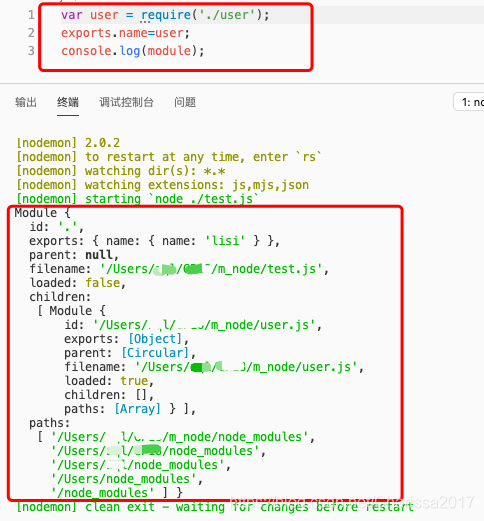
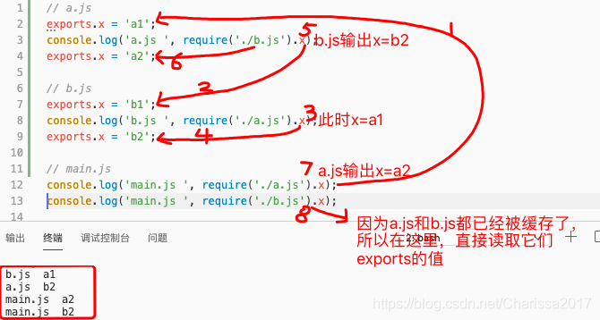

## CommonJS规范
[CommonJS规范-详解](https://blog.csdn.net/Charissa2017/article/details/104928459)

[阮一峰 - CommonJS规范](https://javascript.ruanyifeng.com/nodejs/module.html)

### 关于模块

- Node应用由模块组成，采用CommonJS模块规范。
- 每个文件就是一个模块，有自己的作用域。在一个文件里面定义的变量、函数、类，都是私有的，对其他文件不可见。
- 在模块中使用global定义全局变量，不需要导出，在别的文件中可以访问到。
- CommonJS规范规定，每个模块内部，module变量代表当前模块。这个变量是一个对象，它的exports属性（即module.exports）是对外的接口。加载某个模块，其实是加载该模块的module.exports属性。
- 通过require加载模块，读取并执行一个js文件，然后返回该模块的exports对象。
- 所有代码都运行在模块作用域，不会污染全局作用域。
- 模块可以多次加载，但是只会在第一次加载时运行一次，然后运行结果就被缓存了，以后再加载，就直接读取缓存结果。要想让模块再次运行，需要模块清除缓存。
- 模块加载的顺序，按照其在代码中出现的顺序。

### module对象

- node内部提供一个Module构建函数。所有的模块其实都是Module的实例。
- 每个模块内部，都有一个module对象，代表当前模块。它有以下属性。
	- module.id，模块的识别符，通常是带有绝对路径的模块文件名；
	- module.filename，模块的文件名，带有绝对路径；
	- module.loaded，返回一个boolean值，表示模块是否已经完成加载；
	- module.parent，返回一个对象，表示调用该模块的模块；
	- module.children，返回一个数组，表示该模块内用到的其他模块；
	- module.exports，表示模块对外输出的值；
- 下面是一个示例代码，最后一行输出module变量。



- 如果在命令行下调用某个模块，比如node xxx.js，那么module.parent就是null。如果是在脚本之中调用，比如require('./xxx.js')，那么module.parent就是调用它的模块。利用这一点，可以判断当前模块是否为入口脚本。

### module.exports属性和exports变量

- module.exports属性表示当前模块对外输出的接口，其它文件加载该模块，实际上就是读取module.exports变量。
- 为了方便，node为每一个模块，都提供了一个exports变量，指向module.exports。这等同在每个模块头部，有一条这样的命令：
```javascript
var exports = module.exports;
```
- 所以我们在对外输出模块接口时，可以向exports对象中添加方法或者属性。如下面：
```javascript
module.exports.name = "zhangsan";
exports.name = 'lisi'
exports.age = 18;
```
- 但是注意，不可以直接将exports变量指向一个值，因为这样等于切断了exports和module.exports的联系。
- 如果一个模块的对外接口，是一个单一的值，这种情况就不能使用exports输出，只能使用module.exports输出。
```javascript
//文件a.js
exports = "lisi"; //值导不出去，别的文件导入这个a.js文件，会得到一个空对象

//文件b.js
module.exports = '123';//值能导出去，别的文件导入这个b.js文件，会得到123这个字符串
```
- 下面这种写法中，hello函数是无法对外输出的，因为module.exports被重新赋值了
```javascript
exports.hello = function() {
  return 'hello';
};
module.exports = 'Hello world';
```
- 如果你觉得exports和module.exports之间的区别，很难分清，一个简单的处理方法，就是放弃使用exports ，只使用 module.exports。

### require命令
- Node使用CommonJS模块规范，内置的require命令用于加载模块文件。
- require用于加载模块文件。它的基本功能是，读取并执行一个javascript文件，然后返回该模块的exports对象。如果没有发现指定模块，会报错。
- CommonJS模块的加载机制是，输入的是被输出的值的拷贝，也就是说一旦输出一个值，模块内部的变化就影响不到这个值。
```javascript
//b.js
var counter = 3;
function incCounter(){
    counter ++;
}
module.exports = {
    counter,
    incCounter
}
```
```javascript
//index.js
var counter = require('./b').counter;
var incCounter = require('./b').incCounter;
 
console.log(counter) //3
incCounter();
console.log(counter) //3
```
- 上面代码说明，counter输出以后，b.js模块内部的变化就影响不到counter了

### require命令的内部处理流程
- require命令是CommonJS规范之中，用来加载其他模块的命令。它其实不是一个全局命令，而是指向当前模块的module.require命令，调用module.require命令后，module.require会调用Node的内部命令Module._load。
- 所以在使用require调用模块时，会执行Node的内部命令Module._load，下面是Module._load的运行过程：
	1. 检查Module._cache，缓存之中是否有指定模块
	2. 如果缓存没有的话，就创建一个新的module实例，并把它添加到缓存中，缓存的是它exports导出的值；
	3. 如果缓存中有的话，使用module.load()这个方法，去加载这个模块，读取文件内容后，使用module.compile()执行文件代码；
	4. 如果解析的过程中，出现异常，就从缓存中删除这个模块；
	5. 如果没有出现异常，最后返回这个模块的module.exports；

### require命令加载规则

- 根据参数的不同格式，require命令会去不同路径寻找模块文件。
	1. 如果参数字符串以“/”开头，表示加载的是一个位于绝对路径的模块文件。
	2. 如果参数字符串以“./”开头，表示加载的是一个位于相对路径（跟当前执行脚本的位置相比）的模块文件。
	3. 如果参数字符串不以“/”或者“./”开头，则表示加载的是一个默认提供的核心模块（位于Node的系统安装目录中），或者一个位于各级node_modules目录的已安装模块（全局安装或局部安装）。
	4. 如果参数字符串不以“/”或者“./”开头，而是一个路径，则会先找到该路径目录，然后再以它为参数找到后续路径。
	5. 如果指定的模块文件没有被发现，Node会尝试为文件添加.js、.json、.node后，再去搜索。.js文件会以文本格式的javascript脚本文件解析，.json文件会以JSON格式的文本文件解析，.node文件会以编译后的二进制文件解析。

### 模块的缓存

- 第一次加载某个模块时，Node会缓存该模块。以后再加载该模块，就直接从缓存取出该模块的module.exports属性。
- 模块缓存的案例1：
```javascript
require('./user.js');
require('./user.js').message = "hello";
require('./user.js').message //hello
```
- 上面代码中，连续三次使用require命令，加载同一个模块。第二次加载的时候，为输出的对象添加了一个message属性。但是第三次加载的时候，这个message属性依然存在，这就证明require命令并没有重新加载模块文件，而是输出了缓存。
- 模块缓存的案例2：
```javascript
// a.js
exports.x = 'a1';
console.log('a.js ', require('./b.js').x);
exports.x = 'a2';

// b.js
exports.x = 'b1';
console.log('b.js ', require('./a.js').x);
exports.x = 'b2';

// main.js
console.log('main.js ', require('./a.js').x);
console.log('main.js ', require('./b.js').x);
```
- 上面的例子中，当执行main.js时，加载了a.js，先输出x为a1，又加载了b.js，b.js中输出x为b1，又加载a.js，此时因为之前已经加载过a.js了，所以直接从缓存中读取，a.js的x为a1，所以先打印出"b.js a1"；然后b.js输出x为b2，所以a.js中打印“a.js b2"，然后a.js中又输出x为a2；所以main.js中打印”main.js a2"，第二次再打印的时候，因为a.js和b.js都已经被缓存了，所以直接读取它们的exports的值，所以直接打印出“main.js b2"。



- 所有缓存的模块保存在require.cache之中，如果想删除模块的缓存，可以像下面这样写。
```javascript
// 删除指定模块的缓存
delete require.cache[moduleName];

// 删除所有模块的缓存
Object.keys(require.cache).forEach(function(key) {
  delete require.cache[key];
})
```

- 注意：缓存是根据绝对路径识别模块的，如果同样的模块名，但是保存在不同的路径，require命令还是会重新加载该模块。

### require的其它属性
- require.main
	- require方法有一个main属性，可以用来判断模块是直接执行，还是被调用执行。
	- 直接执行的时候（node xxx.js），require.main属性指向模块本身。
	- 调用执行的时候（通过require加载该脚本执行），上面的表达式返回false。
```javascript
require.main === module // true
```
- require.resolve()
	- 如果想得到require命令所加载模块的文件路径，使用require.resolve()方法。

### CommonJS模块的数据使用
```javascript
//index.js

const b = require('./b.js');
console.log(b.name); //I am b
console.log(b.skills); //[ 'aaa', 'bbb', 'ccc' ]

b.name = '123'
b.skills.push('ddd')
console.log(b.name); //123 在这里修改 基础数据类型 数据，修改的其实是b模块在当前模块的缓存，影响不到模块内部的值
console.log(b.skills); //[ 'aaa', 'bbb', 'ccc', 'ddd' ]

b.say();
//I am b
//[ 'aaa', 'bbb', 'ccc', 'ddd' ]

// 将上面的代码注释，运行下面的代码

const b = require('./b.js');
console.log(b.name); //I am b
console.log(b.skills); //[ 'aaa', 'bbb', 'ccc' ]

b.set('123','ddd');
b.say();
//123
//[ 'aaa', 'bbb', 'ccc', 'ddd' ]

console.log(b.name); //I am b  虽然b模块内部的值变成了 “123”  但这里仍是 “I am b” 是因为这里读取的是b模块在当前模块的缓存，当前模块缓存的这个值 与 模块内部的值 其实已经属于两个值了。如果你想得到b模块内部最新的值，可以通过b模块里的方法暴露这个值，如say方法
console.log(b.skills); //[ 'aaa', 'bbb', 'ccc', 'ddd' ]

// 总结：引用类型数据是引用，基础类型数据是拷贝。数据浅拷贝。
```
```javascript
//b.js

var name = 'I am b';
var skills = ['aaa', 'bbb', 'ccc'];
var set = function (newName, newSkillItem) {
    name = newName;
    skills.push(newSkillItem);
}
var say = function () {
    console.log(name);
    console.log(skills);
}

exports.name = name;
exports.skills = skills;
exports.set = set;
exports.say = say;
```