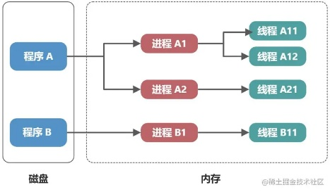

## 多进程与多线程

- 在操作系统里，进程(process)是正在运行的程序的实例。
- 在多进程中，每个进程都可以看作是一个独立的执行程序，它们有各自的数据空间和地址空间，各个进程彼此独立，因此它们之间没有共享内存区域(但多进程之间也是可以进行进行通信的，只是没有比多线程之间通信方便，多进程之间通信需要使用点骚操作)。
- 在多线程中，多线程共享同一个进程的内存空间，可以直接读写共享内存中的数据，因此线程(thread)是被包含在进程之中的。
- 进程与线程的不同点是，它们在 数据共享、通信机制 等方面存在有差异。但一定切记，线程是运行在进程里的。
- 单线程的意思是，在任何给定的时间点，它只能执行一个任务。
- 多进程通常用于多核或多计算机的分布式计算，而多线程则更适用于单核或少核的计算机。
- 多进程适用于并行度较高的场景，如计算密集型任务。而多线程适用于I/O密集型任务，尤其是需要与用户界面交互的场景。
- 多进程适用于需要大量计算资源的场景，比如科学计算、大数据处理等。
- 多线程适用于需要与用户界面交互的场景，比如Web服务器、图形界面应用程序等。

## 举个栗子1
```
一个 程序A 在运行，这个运行的 程序A 就是一个进程。
多个 程序A 同时运行，这时有多个进程。
---
程序A 可以做两件事：吃饭、睡觉。
但 程序A 做事时，在任何给定的时间点，它只能做一件事。
程序A 开启多线程后，程序A 可以同时吃饭和睡觉。
```

## 举个栗子2
```
程序A 可以运行在一个进程上。
多进程，多个 程序A 分别(同时)运行在多个进程上。
---
程序A 可以做 吃饭,睡觉 两件事。
但 程序A 做事时，在任何给定的时间点，它只能执行一件事。
程序A 开启多线程后，程序A 可以同时吃饭和睡觉。
```

## 举个栗子3
```
将 进程 比作成 你这个人。
多进程，说明你是孙悟空，会分身术，多个你，一块打妖怪。
---
将 线程 比作成 技能(任务/事情/功能)。
你有多个技能，打妖怪 和 为唐僧做饭 等 。
单线程时，你在任何给定的时间点，只能做一件事。
开启多线程后，你可以 为唐僧做饭 的同时 打妖怪。
```

## 应用案例1
有一个 Node.js 脚本程序，定时从某个服务器下载文件，并向另一个云服务商上传文件。但是每次只能先下载一个文件，再去上传一个文件。效率比较低。怎么样才能提高效率？

- Node.js 是在单个线程中运行的，虽然没办法开启额外的线程，但是可以开启多进程。这样可以让下载任务和上传任务同时进行。（这里 Node.js 使用多进程是因为，Node.js 里没有多线程功能，Node.js 只有多进程功能，所以使用多进程功能模拟了多线程功能。从狭义的角度上理解，这个 下载上传文件的 Node.js 脚本程序，是进程。而这个 Node.js 脚本程序里的，下载和上传(功能/任务/事情) 是线程。）

## 应用案例2
- 进程可以隔离应用，比如当奔溃时，不互相影响。
- 一个正在运行的手机app实例就是进程，app里面的各种功能是线程。

## 进程与线程总结
- 在操作系统里，一个"正在运行的程序的实例"就是一个进程，启动一个应用程序就会启动一个或多个进程(如下图，Chrome浏览器一般会开启多个进程)，进程有自己的独立地址空间，每启动一个进程(process)，系统就会为它分配一个地址空间。

- 在操作系统里，进程启动后自动创建线程(thread)，线程用来执行程序中的代码，它被包含在进程之中。
- 在操作系统里，进程是资源分配的最小单位，一个程序至少有一个进程。而线程是程序执行的最小单位。一个进程至少有一个线程。
- 可以把操作系统看成是工厂，进程比作车间，而线程就是工人，进程是线程的容器，真正干活的是线程。
- 下图，程序A 有多个进程(程序A 现在有多个正在运行的程序实例)，进程A1 同时运行多个线程(这时 程序A 也可以被称为多线程运行)

- js 是单线程运行的，js 线程的容器进程，是浏览器或Node.js。大多数现代浏览器是多进程的，打开一个 tab 页就开启一个进程，每个进程里包含多个线程，其中就有执行 js 的线程。因为 js 是单线程的，所以在同一时刻，js 只能做一件事情，如果遇到某些耗时的操作，比如一个循环次数非常大的 for 循环，就会阻塞当前的线程。为了避免阻塞的发生，那些比较耗时的操作，实际并非由 js 线程来执行，而是交给浏览器的其它线程来完成。
- 在代码里，进程和线程的概念可以进行抽象，甚至可以将一个运行的函数实例抽象成进程或线程，这样可以利用进程和线程的概念，实现并行处理、并行计算、同时处理不同任务 等功能。
- 在Node.js中使用多进程非常简单，合理使用多进程，可以解放硬件的能力，让Node.js的运行效率得到肉眼可见的提升。
- 将一个运行Node脚本程序抽象成进程，而这个脚本程序里面运行的上传和下载功能是线程。如果想为了NodeHttp脚本服务的稳定，奔溃后不影响其它人的使用。可以为这个Node脚本程序开启多进程。

