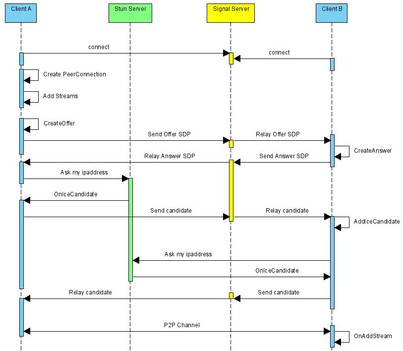
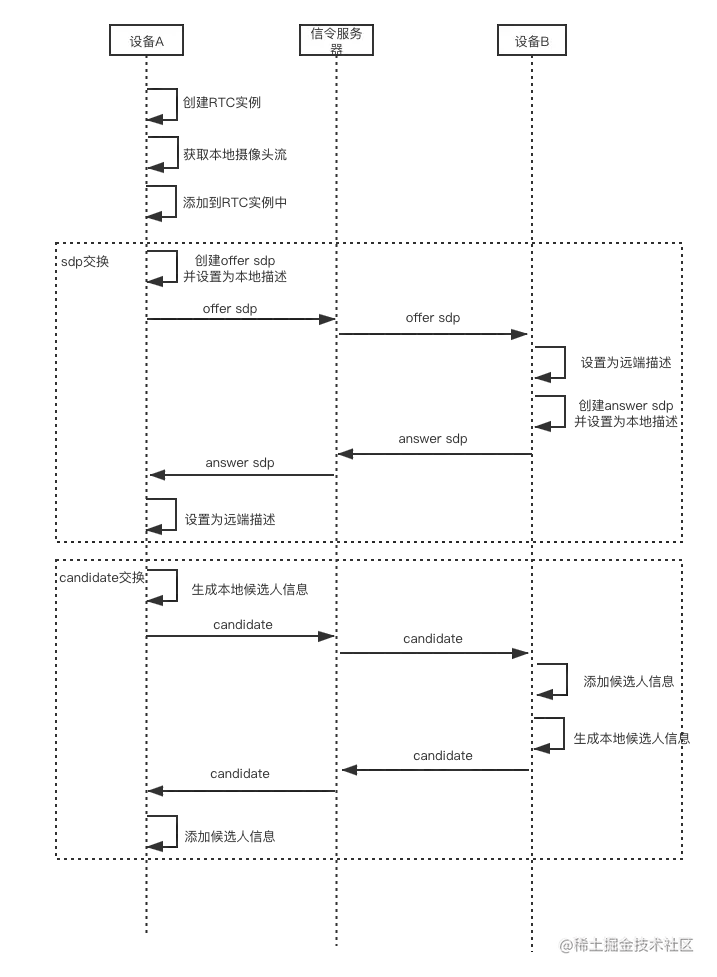

# 局域网 WebRTC 1对1 Demo

Demo需要https服务，没有https服务无法打开摄像头。[制作ssl证书](./自制ssl证书.md)

```
# 进入项目根目录
cd webrtc

# 安装依赖
npm install

# 启动项目
node index.js

# 浏览器地址栏输入 https://192.168.31.95/oneToOne.html
```

### Demo真机运行实测

|  运行环境       | 兼容情况  |
|  ----           | ----      |
| 电脑+win11+edge   | √         |
| 电脑+win11+chrome    | √         |
| ipad+ipadOS16+chrome    | √         |
| 小米6+miui11+chrome         | √         |
| 红米Note10Pro+miui13+chrome  | √         |
| 红米Note12+miui13+chrome    | √         |
| 小米12+hyperos+chrome    | ×         |
| 红米K70E+hyperos+chrome   | ×         |

### WebRTC介绍

WebRTC（Web Real-Time Communication）。Web实时通信。

WebRTC允许网络应用或者站点，在不借助中间媒介的情况下，建立浏览器之间点对点（Peer-to-Peer）的连接，实现视频流和（或）音频流或者其他任意数据的传输（如文件共享）。而 WebRTC 不借助中间媒介 的意思是，在建立对等连接后，不需要借助第三方服务器中转，而是直接在两个实体（浏览器）间进行传输。

WebRTC用到了WebSocket。WebSocket是一种在单个TCP连接上进行全双工通信的协议。WebSocket使得客户端和服务器之间的数据交换变得更加简单，允许服务端主动向客户端推送数据。在WebSocket API中，浏览器和服务器只需要完成一次握手，两者之间就直接可以创建持久性的连接，并进行双向数据传输。

### WebRTC流程

简单说一下流程，如浏览器A 想和浏览器B 进行音视频通话：

1、A、B 都连接信令服务器（ws）；<br>
2、A 创建本地视频，并获取会话描述对象（offer sdp）信息；<br>
3、A 将 offer sdp 通过 ws 发送给 B；<br>
4、B 收到信令后，B 创建本地视频，并获取会话描述对象（answer sdp）信息；<br>
5、B 将 answer sdp 通过 ws 发送给 A；<br>
6、A 和 B 开始打洞，收集并通过 ws 交换 ice 信息；<br>
7、完成打洞后，A 和 B 开始为安全的媒体通信协商秘钥；<br>
8、至此， A 和 B 可以进行音视频通话。<br>

引用网上的有关WebRTC建立的时序图，可能更加直观：




从上述流程，可以发现通信双方在建立连接前需要交换信息，这也就是开头提到的 WebSocket 充当的角色：信令服务器，用于转发信息。

### WebRTC代码

第一步

连接信令服务器，获取视频标签，创建 RTCPeerConnection 对象。其中 RTCPeerConnection 的作用是在 两个对等端 之间建立连接，其构造函数支持传一个配置对象，包含ICE“打洞”
```javascript
const localVideo = document.querySelector('#local-video');
const remoteVideo = document.querySelector('#remote-video');
const socket = new WebSocket('ws://localhost:8080');
const peer = new RTCPeerConnection();

socket.onmessage = () => { /*todo*/ }
peer.ontrack = () => { /*todo*/ }
peer.onicecandidate = () => { /*todo*/ }
```

第二步

获取本地摄像头/麦克风（需要允许使用权限），拿到本地媒体流（MediaStream）后，需要将其中所有媒体轨道（MediaStreamTrack）添加到轨道集，这些轨道将被发送到另一对等方。
```javascript
navigator.mediaDevices.getUserMedia({ video: true, audio: true })
	.then(stream => {
		localVideo.srcObject = stream;
		stream.getTracks().forEach(track => {
			peer.addTrack(track, stream);
		});
	});
```

第三步

创建发起方会话描述对象（createOffer），设置本地SDP（setLocalDescription），并通过信令服务器发送到对等端，以启动与远程对等端的新WebRTC连接。

```javascript
peer.createOffer().then(offer => {
	peer.setLocalDescription(offer);
	socket.send(JSON.stringify(offer));
});
```

当调用 setLocalDescription 方法，PeerConnection 开始收集候选人（ice信息），并发送offer_ice到对等方。这边补充第一步中的 peer.onicecandidate 和 socket.onmessage

对等方收到ice信息后，通过调用 addIceCandidate 将接收的候选者信息传递给浏览器的ICE代理。

```javascript
peer.onicecandidate = e => {
	if (e.candidate) {
		socket.send(JSON.stringify({
			type: 'offer_ice',
			iceCandidate: e.candidate
		}));
	} 
};

socket.onmessage = e => {
	const { type, sdp, iceCandidate } = JSON.parse(e.data);
	if (type === 'offer_ice') {
		peer.addIceCandidate(iceCandidate);
	}
}
```

第四步

接收方收到了offer信令后，开始获取摄像头/麦克风，与发起方操作一致。同时将收到offer SDP指定为连接的远程 对等方 属性（setRemoteDescription），并创建应答SDP（createAnswer），发送到对等端。这边补充第一步中的 socket.onmessage。

```javascript
socket.onmessage = e => {
	const { type, sdp, iceCandidate } = JSON.parse(e.data);
	if (type === 'offer') {
		navigator.mediaDevices.getUserMedia();		// 与发起方一致，省略
		const offerSdp = new RTCSessionDescription({ type, sdp });
		peer.setRemoteDescription(offerSdp).then(() => {
			peer.createAnswer(answer => {
				socket.send(JSON.stringify(answer));
				peer.setLocalDescription(answer)
			});
		});
	}
}
```

注意：当 setLocalDescription 方法调用后，开始收集候选人信息，并发送 answer_ice 到对等方。与发送方同理。

第五步

通过不断收集ICE信息（onicecandidate），发起方和应答方最终将建立一条最优的连接方式，此时会触发 ontrack 回调，即可获取到对等方的媒体流。

```javascript
peer.ontrack = e => {
	if (e && e.streams) {
		remoteVideo.srcObject = e.streams[0];
	}
};
```


WebRTC主要的API包括：

RTCPeerConnection：表示本地端和远程对等端之间的 WebRTC 连接。它提供了创建远程对等端连接、维护和监视连接，以及在连接不再需要时关闭连接的方法。通过 RTCPeerConnection 流式传输视频。

RTCSessionDescription：描述连接或潜在连接的一端的配置方式。描述请求/应答协商过程的SDP协议的相关描述

navigator.getUserMedia：捕捉音频和视频。

RTCPeerConnection: icecandidate 事件：当 RTCPeerConnection 通过 RTCPeerConnection.setLocalDescription() 方法更改本地描述之后，该 RTCPeerConnection 会抛出 icecandidate 事件。该事件的监听器需要将更改后的描述信息传送给远端 RTCPeerConnection，以更新远端的备选源。触发 icecandidate 事件的首要原因：当获得新的源之后，需要将该源的信息发送给远端信号服务器，并分发至其他端的 RTCPeerConnection。其他 RTCPeerConnection 通过 addIceCandidate() 方法将新 candidate 中携带的信息，将新的源描述信息添加进它的备选池中；


### 参考链接

[WebRTC + WebSocket 实现视频通话](https://blog.csdn.net/m0_60259116/article/details/132050287)

[用WebRTC和Node.js开发实时视频聊天应用](https://webrtc.org.cn/20201119-nodejs/)

[利用 WebRTC 实现实时通信](https://developers.google.cn/codelabs/webrtc-web)

[RTCPeerConnection: icecandidate 事件](https://developer.mozilla.org/zh-CN/docs/Web/API/RTCPeerConnection/icecandidate_event)

[WebRTC学习总结](https://juejin.cn/post/6844903624561147918)

[使用JS+socket.io+WebRTC+nodejs+express搭建一个简易版远程视频聊天](https://juejin.cn/post/6945058424350605319)

[50行代码完成视频通话 (WebRTC + WebSocket)](https://juejin.cn/post/6844903976584871943)

[WebRTC 入门与实战教程](https://juejin.cn/post/6844903829306097677)

[有了WebRTC，直播可以这样玩！](https://juejin.cn/post/6964571538729205773)

[WebRtc实时视频通信（截图）](https://juejin.cn/post/6882639920012361741)