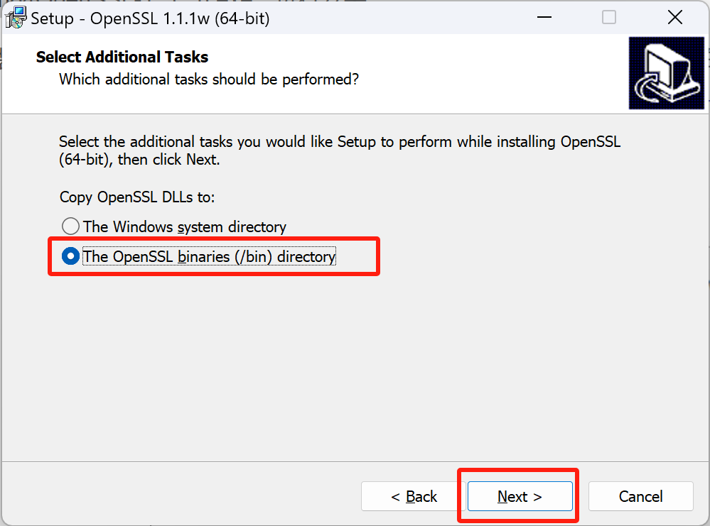
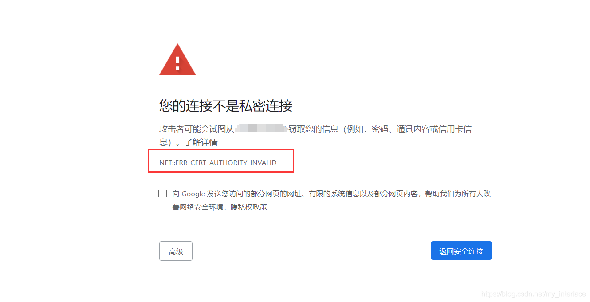

# 自制ssl证书

使用openssl自制ssl证书

### 安装openssl

安装openssl有两种方式，第一种是从[官网](https://www.openssl.org)下载源码，然后自己编译；第二种是下载安装网友已经编译好的，如下是网友做好的便捷版安装包下载地址：[https://slproweb.com/products/Win32OpenSSL.html](https://slproweb.com/products/Win32OpenSSL.html)

电脑是Win64位系统，所以下载Win64版本的安装包


下载好后安装软件


选择安装位置


这里“Select Additional Tasks”，让选择OpenSSL的dll拷贝到什么地方。建议，不要拷贝到系统目录下，如果其他软件使用的OpenSSL版本与你安装这个版本不同，可能导致该软件无法使用。所以让这些dll待在OpenSSL安装目录下即可。自带了openssl的软件有Git、VMware等



最后一步，是否捐款，看个人情况，全取消就是不捐。


安装完毕后，打开软件安装目录，然后进入bin目录，找到openssl.exe


在bin目录下，按 “Shift + 鼠标右键” 打开命令行，输入 “./openssl version” 查看openssl版本


### 使用openssl申请ssl证书

#### 创建根证书

新建anxinCA.cnf文件并输入以下内容:
```
[ req ]
distinguished_name  = req_distinguished_name
x509_extensions     = root_ca
 
[ req_distinguished_name ]
 
# 以下内容可随意填写
countryName             = CN (2 letter code)
countryName_min         = 2
countryName_max         = 2
stateOrProvinceName     = beijing
localityName            = beijing
0.organizationName      = anxin
organizationalUnitName  = technology 
commonName              = anxin
commonName_max          = 64
emailAddress            = concat@anxin.com 
emailAddress_max        = 64
 
[ root_ca ]
basicConstraints            = critical, CA:true
```

然后再创建一个文件anxinServerCA.ext并输入以下内容:
```
subjectAltName = @anxin
extendedKeyUsage = serverAuth
 
[anxin]
 
# 域名，如有多个用DNS.2,DNS.3…来增加
DNS.1 = 
# IP地址
IP.1 = 192.168.137.1
```
anxinCA.cnf文件是申请CA根证书的配置文件;

anxinServerCA.ext是生成服务器证书的扩展配置文件;

打开cmd执行如下命令

注意1、下面命令中的anxin CA可以改为自己的信息，然后/CN=192.168.137.1也要改为自己要对应的ip

注意2、下面命令中的anxinServerCA.pvk可以改成anxinServerCA.key
```
openssl req -x509 -newkey rsa:2048 -out anxinCA.cer -outform PEM -keyout anxinCA.pvk -days 10000 -verbose -config anxinCA.cnf -nodes -sha256 -subj "/CN=anxin CA"

openssl req -newkey rsa:2048 -keyout anxinServerCA.pvk -out anxinServerCA.req -subj /CN=192.168.137.1 -sha256 -nodes

openssl x509 -req -CA anxinCA.cer -CAkey anxinCA.pvk -in anxinServerCA.req -out anxinServerCA.cer -days 10000 -extfile anxinServerCA.ext -sha256 -set_serial 0x1111
```

执行完毕后会生成相应的文件


为了在node.js中使用，需要把anxinServerCA.cer转换成anxinServerCA.crt，转换命令如下
```
openssl x509 -inform PEM -in anxinServerCA.cer -out anxinServerCA.crt
```

到此证书生成完毕

在node.js中配置服务端证书


配置完成之后，打开chrome浏览器访问的时候，会提示不安全。然后 安装客户端证书。安装步骤如下

双击anxinCA.cer文件 -- 安装证书 -- 选择当前用户(或本地计算机) -- 将所有证书都放入下列存储 -- 点击浏览 -- 受信任的根证书颁发机构


点击确定，然后下一步，会提示导入完成。此时关闭浏览器重新打开，然后左上角变为 安全连接 即可。

注意，如果此时还是不安全， 记得一定要重启电脑然后再打开浏览器尝试，如果还不行，重新尝试生成证书。

此时若还不安全，报错误代码：NET::ERR_CERT_AUTHORITY_INVALID



解决办法。在chrome的地址栏里输入 chrome://net-internals/#hsts 把192.168.137.1从HSTS中删除，然后重启浏览器

原因在于chrome浏览器新加入了HSTS策略（见上图红色圈）。使用的HSTS策略是chrome加入的新特性，使用该策略的网站，会强制浏览器使用HTTPS协议与该网站通信


Win删除证书，【Win+R】—> certmgr.msc —> 操作 —> 查找证书 —> 右键删除

Android安装证书，打开WLAN菜单 --> 高级WLAN设置 --> 证书管理 --> 安装证书 --> 找到之前下载的证书xxxxx.cer安装证书

IOS暂时不会设置CA证书

### 参考链接

[环境篇-Windows下安装OpenSSL](https://blog.csdn.net/zyhse/article/details/108186278)

[windows安装OpenSSL](https://www.cnblogs.com/dingshaohua/p/12271280.html)

[内网使用openssl自签名证书开启https连接，同时解决chrome浏览器中的不安全访问](https://blog.csdn.net/my_interface/article/details/112224658)

[如何使用 openssl 命令将.cer 格式的证书转化为.crt 格式的证书？](https://blog.csdn.net/weixin_50512016/article/details/109477058)


