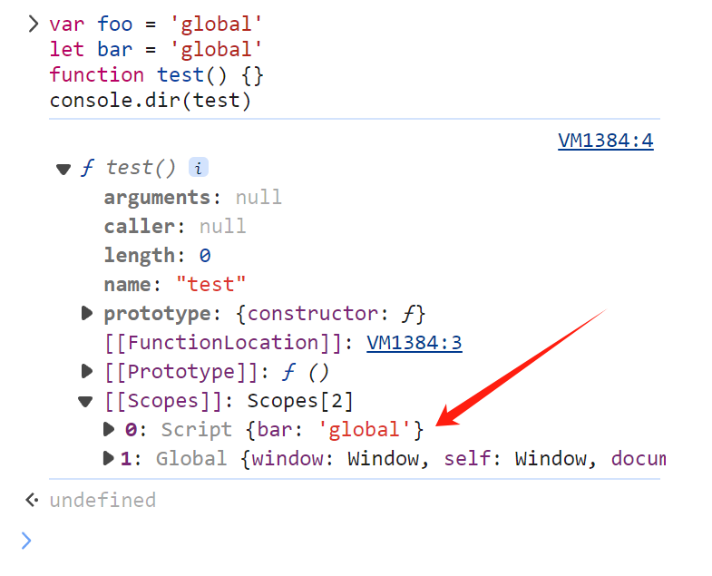

# var、let、const的区别

js 内 var、let、const 都是用来声明变量的关键字， 其中 let、const 关键字是在 ES6 中才新增的。

### var 与 let 区别(作用域)：

var 声明的变量的作用域是它当前的执行上下文，即如果是在任何函数的外面，则是全局执行上下文。如果是在函数里面，则是当前函数执行上下文。换句话说 var 声明的变量的作用域只能是全局作用域或者是某个函数作用域。

let 声明的变量的作用域是它当前所处代码块，即它的作用域既可以是全局作用域，也可以是某个函数作用域，也还可以是由 if、while、switch、for 等等 使用 {} 限定的代码块的块级作用域。

此外，var 和 let 的作用域规则都是一样的，其声明的变量只在其声明的块或子块(区域或子域)中可用。

在如下示例中可以看出，let 声明的变量的作用域 可以比 var 声明的变量的作用域 有更小的限定范围，更具灵活性。

```javascript
function varTest() {
  var a = 1;
  {
    var a = 2; // 函数中，同一个变量
    console.log(a); // 2
  }
  console.log(a); // 2
}

function letTest() {
  let a = 1;
  {
    let a = 2; // 代码块中，新的变量
    console.log(a); // 2
  }
  console.log(a); // 1
}

varTest();
letTest();
```

### var 与 let 区别(变量重复声明)：

var 允许在同一作用域中重复声明。

let 不允许在同一作用域中重复声明，否则将抛出异常。

var 示例代码：
```javascript
function test() {
  var a = 3;
  var a = 4;
  console.log(a); // 4
}
test();
```

let 示例代码：
```javascript
switch(index) {
  case 0:
    let a = 1;
    break;
  default:
    let a = 2; // SyntaxError: Identifier 'a' has already been declared
    break;
}
```

### var 与 let 区别(绑定全局对象)：

var 在全局环境中声明变量，会在全局对象里新建一个属性。

let 在全局环境中声明变量，不会在全局对象里新建一个属性。

var let 示例代码：
```javascript
var foo = 'global'
let bar = 'global'
console.log(foo) // global
console.log(bar) // global
console.log(window===this) // true
console.log(this.foo) // global
console.log(this.bar) // undefined
```

那这里就有一个疑问， let 在全局环境中声明的变量不在全局对象的属性中，那它是保存在哪呢？

在浏览器的控制台中，执行如下代码，查看 test 函数的作用域链
```javascript
var foo = 'global'
let bar = 'global'
function test() {}
console.dir(test)
```
let 在全局环境中声明的变量 bar 保存在图中 [[Scopes]][0]: Script 这个变量对象的属性中。

图中 [[Scopes]][1]: Global 就是我们常说的全局对象。



### var 与 let 区别(变量提升与暂存死区)：

全局或者函数环境下，在代码执行前，会有预编译阶段，在预编译过程中，会先在代码内找函数形参和var变量声明，然后将函数形参和var变量声明的变量名添加到AO对象并初始化值为undefined。而这一操作，就是我们通常所说的“变量提升”

变量提升示例：
```javascript
console.log(a) // undefined
var a = 1;
console.log(a) // 1
```

let 声明变量存在暂存死区，如何理解暂存死区呢？

其实 let 也存在与 var 类似的“变量提升”过程，但与 var 不同的是，在代码(块)执行前，代码(块)预编译阶段 let 只会创建变量而不会初始化值undefined。（注意这里var与let的区别 “let在预编译阶段只创建变量而不初始化值”，“var在预编译阶段不仅会创建变量而且还会初始化值为undefined”）

那 let 什么时候初始化值呢？

ES6 规定，其初始化值是在代码执行阶段（即直到它们的"定义语句"被执行时才初始化值）

而 暂存死区(Temporal Dead Zone) 就是指 let变量被创建的那一刻开始，到它被初始化值的(那一刻/那一期间)。

直到为 let 变量初始化值之前，该变量都是不可访问的。如果你尝试在“暂存死区”期间 访问该变量，则JavaScript会抛出一个引用错误（ReferenceError）

```javascript
{
  //注意，如果直接在浏览器控制台运行如下代码，那请在代码外 套上 { } ，否则报错将打印 Uncaught ReferenceError: foo is not defined 。打印foo未定义，是因为，浏览器控制台环境已经预编译结束(已经初始化完毕)，已经进入到代码执行阶段。在代码执行阶段，在控制台输入(let foo = 2;)代码将直接运行，没有预编译。而如果你在代码外 套上 { } 后，{ } 这个块级 会因为let的缘故，会先进行预编译，然后再执行。
  console.log(bar); // undefined
  console.log(foo); // Uncaught ReferenceError: Cannot access 'foo' before initialization  这里let变量已创建，但还未初始化值。所以这里let还处于“暂存死区”期间，所以才会报错 初始化前无法访问foo
  var bar = 1;
  let foo = 2;
}
```
```javascript
{
  console.log(xx) // Uncaught ReferenceError: Cannot access 'xx' before initialization
  let xx;
}
```
```javascript
{
  let x;
  console.log(x); //undefined  //这里打印undefined，是因为上边(let x)没有写(let x=10)这种语法，所以默认初始化值为undefined
}
```
### let 与 const 区别：

const 与 let 很类似，具有上面提到的 let 的特性，唯一区别就在于 const 声明的是一个只读变量，声明之后不允许改变其值。因此，const 一旦声明必须初始化，否则会报错。

const 示例：
```javascript
let a;
const b = "constant"
a = "variable"
b = 'change' // TypeError: Assignment to constant variable
```

如何理解声明之后不允许改变其值？

const 不允许改变保存在 栈内存 中的地址和值。

地址 是指，栈内存里保存着引用数据类型在堆内存中的引用地址。

值 是指，栈内存中保存着基本数据类型的数据的值。所以 const 声明的基本数据类型的数据，有类似其它语言中声明常量的作用。

const 示例2：
```javascript
const obj = {
  value: 1
}
obj.value = 2 // 引用数据类型的数据的本体，保存在 堆内存里。这里改变的是 堆内存 中的数据，所以没有报错。
console.log(obj) // { value: 2 }
obj = {} // TypeError: Assignment to constant variable //栈内存里保存着引用数据类型数据在堆内存中的引用地址。这里保存在栈内存中的引用地址发生改变，所以报错。
```

### 块级作用域：

JavaScript中的作用域主要有全局作用域、函数作用域和块级作用域三种。

在ES6之前，JavaScript只有全局作用域、函数作用域，没有块级作用域。而从ES6开始，JavaScript引入了let和const关键字，自此js中出现块级作用域。

块级作用域，块级是指 代码块 ，这个代码块可以是 if、while、switch、for 等等 使用 {} 限定的代码块，也可以是函数代码块等等。

示例：
```javascript
// 函数代码块
function abc(){
  // ...
  let value = 10;
  // ...
}

// if 等等代码块
if(true){
  // ...
  let a = 10
  // ...
}
```

### 参考文献：

[深入理解JS：var、let、const的异同 - OneForCheng - 博客园](https://www.cnblogs.com/forcheng/p/13033976.html)